Dugong mitochondrial genomes
================
23/04/2026

Reads were mapped to the reference genome using bwa mem. This included
my samples, Tian et al.’s data
(<https://doi.org/10.1038/s41467-024-49769-x>), and individual samples
DRR251525 and ERR5621402 from NCBI.

``` bash
ref=mDugDug1.MT.20230221.fasta

bams=(mapped_marked_bams/*.bam)

input=${bams[$SLURM_ARRAY_TASK_ID]}

bn=$(basename $input)

output=mitobams/${bn%_marked.bam}_mito.bam

mkdir -p mitobams

echo "Starting mapping for ${output}"

samtools collate -Oun128 ${input} | samtools fastq - \
  | bwa mem -pt8 ${ref} - | samtools view -F 4 -O BAM - > ${output} 

echo "Done ${output}"
```

To get fasta files for each one, I ran this command:

``` bash
for bam in mitobams/*_mito_fixed_sorted.bam; do
    sample=$(basename "$bam" "_mito_fixed_sorted.bam")
    echo "Processing $sample"

    # Generate VCF
    bcftools mpileup -f mDugDug1.MT.20230221.fasta "$bam" | \
        bcftools call -mv -Oz -o "mito_fasta/${sample}.vcf.gz"

    # Index VCF
    bcftools index "mito_fasta/${sample}.vcf.gz"

    # Generate consensus FASTA
    bcftools consensus -f mDugDug1.MT.20230221.fasta \
        "mito_fasta/${sample}.vcf.gz" > "mito_fasta/${sample}.fasta"
done
```

For comparisons with publicly available control region data, I
downloaded all sequences with these search terms from NCBI: “Dugong
dugon”\[Organism\] AND (mitochondrion OR “control region” OR “D-loop”)

I also have my own samples and the ones from the Tian paper available as
a fasta file.

I used Geneious to align the sequences to the mt DugDug sequence that is
from the same animal as our nuclear reference genome. I also added a
manatee sequence as an outgroup. I went through the sequences and made
sure they all align ok and that one out-of-place base does not cause a
huge mismatch. The final extract was

Then I cut out only the part that aligns for all these sequences, which
obviously seems to be the control region, but it is admittedly only a
very small part of that region still (304bp).

``` r
gb_file <- "02_Mitogenomes_local/All-ncbi-downloads-metadata.gb"

lines <- readLines(gb_file)

records <- str_split(paste(lines, collapse = "\n"), "//")[[1]]

# Function to extract metadata from a record
extract_gb_record <- function(record) {
  isolate   <- str_match(record, '/isolate="([^"]+)"')[,2]
  geo       <- str_match(record, '/geo_loc_name="([^"]+)"')[,2]
  country   <- str_match(record, '/country="([^"]+)"')[,2]
  organism  <- str_match(record, '/organism="([^"]+)"')[,2]
  accession <- str_match(record, 'ACCESSION\\s+([A-Z0-9_]+)')[,2]
  version   <- str_match(record, 'VERSION\\s+([A-Z0-9_.]+)')[,2]

  region <- coalesce(geo[!is.na(geo)][1],
                     country[!is.na(country)][1],
                     NA_character_)

  if (!is.na(isolate[1]) && str_detect(isolate[1], "^DU") && (is.na(region) || region == "")) {
    region <- "Thailand"
  }

  tibble(
    TreeID  = version[!is.na(version)][1],   
    ID      = isolate[!is.na(isolate)][1],
    Region  = region,
    Organism = organism[!is.na(organism)][1],
    Accession = accession[!is.na(accession)][1],
    Source = "NCBI"
  )
}

ncbi_meta <- map_dfr(records, extract_gb_record)

ncbi_meta_simple <- ncbi_meta %>% 
  select(TreeID, Region, Source)

# Load master metadata
dugong_meta <- read_csv(
  "Dugong_metadata_FINAL.csv",
  col_types = cols(.default = col_character())
)
```

    ## New names:
    ## • `specimen_id` -> `specimen_id...6`
    ## • `specimen_id` -> `specimen_id...7`

``` r
dugong_meta <- dugong_meta %>%
  mutate(
    decimal_longitude_private = as.numeric(decimal_longitude_private),
    decimal_latitude_private  = as.numeric(decimal_latitude_private)
  )

dugong_meta <- dugong_meta %>%
  mutate(
    country = dplyr::recode(
      country,
      "New_Caledonia" = "New Caledonia"
    )
  )

traits_from_master <- dugong_meta %>%
  transmute(
    TreeID = bioplatforms_library_id,
    Region = location_text,
    Source = "Local"
  ) %>%
  filter(!is.na(TreeID))


# Combine LOCAL + NCBI
all_meta_full <- bind_rows(traits_from_master, ncbi_meta_simple) %>%
  distinct(TreeID, .keep_all = TRUE)


write_csv(
  traits_from_master %>% select(TreeID, Region),
  "02_Mitogenomes_local/traits_local_final.csv"
)

Control_region_tree <- read.tree("02_Mitogenomes_local/Extract8.fasta.contree")

Control_region_tree_rooted <- root(
  Control_region_tree,
  outgroup = "AM904728.1",
  resolve.root = TRUE
)

tree_data <- tibble(
  label = Control_region_tree_rooted$tip.label
) %>%
  left_join(all_meta_full, by = c("label" = "TreeID"))
```

Next, I’m turning this into a popart-useable nexus file to make
Haplotype networks.

``` r
region_map <- c(
  # WA
  "Shark_Bay" = "WA",
  "Exmouth_Gulf" = "WA",
  "Broome" = "WA",
  "Port_Hedland" = "WA",
  "One_Arm_Point" = "WA",
  "Barrow_Island" = "WA",

  # QLD
  "Starcke" = "QLD",
  "Elim_Beach" = "QLD",
  "Torres_Strait" = "QLD",
  "Hinchinbrook" = "QLD",
  "Yarrabah" = "QLD",
  "Turtle_Head_Island" = "QLD",
  "Emu_Park" = "QLD",
  "Hervey_Bay" = "QLD",
  "Clairview" = "QLD",
  "Gladstone" = "QLD",
  "Daintree" = "QLD",
  "Port_Douglas" = "QLD",
  "Great_Sandy_Strait" = "QLD",
  "Bowling_Green_Bay" = "QLD",
  "Townsville" = "QLD",
  "Airlie_Beach" = "QLD",
  "Shoalwater_Bay" = "QLD",
  "Moreton_Bay" = "QLD",

  # NT
  "Darwin" = "NT",
  "Wellesley_Islands" = "NT",
  "Pellew_Islands" = "NT",

  # NSW
  "Arcadia_Vale" = "NSW",

  # International
  "United_Arab_Emirates" = "UAE",
  "United_Arab_Emirates__Abu_Dhabi" = "UAE",
  "Abu_Dhabi" = "UAE",

  "Tanzania" = "Tanzania",
  "Tanzania__Rufiji" = "Tanzania",
  "Tanzania__Rufiji_Mafia_District" = "Tanzania",

  "Indian_Ocean__Nicobar_Islands" = "Nicobar_Islands",
  "Mauritius__Fort_Frederik_Hendrik" = "Mauritius"
)

traits_for_popart <- tree_data %>%
  select(label, Region) %>%
  distinct() %>%
  rename(ID = label) %>%
  mutate(

    Region_original = Region,

    Region = gsub("[^A-Za-z0-9_]", "_", Region),

    Region = case_when(

      # Existing labels
      Region %in% c("QLD", "WA", "NT", "NSW",
                    "Thailand", "UAE",
                    "Tanzania", "Mauritius",
                    "Palau", "Malaysia",
                    "Indonesia", "India",
                    "Japan", "Comoros",
                    "Kenya", "Egypt",
                    "Sudan", "Yemen",
                    "Djibouti", "Bahrain",
                    "Mozambique",
                    "Madagascar",
                    "Sri_Lanka",
                    "Philippines",
                    "New_Caledonia",
                    "Papua_New_Guinea",
                    "Nicobar_Islands",
                    "Indian_Ocean",
                    "Indian_Ocean__Africa",
                    "Indian_Ocean__Red_Sea",
                    "Australia") ~ Region,

      # Queensland
      grepl("Queensland|Torres_Strait|Townsville|Moreton_Bay|Hervey_Bay|Gladstone|Clairview|Yarrabah|Daintree|Port_Douglas|Shoalwater_Bay|Airlie_Beach|Bowling_Green_Bay|Hinchinbrook|Elim_Beach|Starcke|Emu_Park|Magnetic_Island|Bamaga",
             Region) ~ "QLD",

      # WA
      grepl("Western_Australia|Shark_Bay|Exmouth_Gulf|Broome|Port_Hedland|One_Arm_Point|Barrow_Island",
             Region) ~ "WA",

      # NT
      grepl("Darwin|Wellesley_Islands|Pellew_Islands",
             Region) ~ "NT",

      # NSW
      grepl("Sydney|Arcadia_Vale",
             Region) ~ "NSW",

      # UAE
      grepl("United_Arab_Emirates|Abu_Dhabi",
             Region) ~ "UAE",

      TRUE ~ Region
    )
  )

traits_for_popart <- traits_for_popart %>%
  mutate(
    Region = ifelse(
      grepl("^Thailand", Region),
      "Thailand",
      Region
    )
  )

traits_for_popart <- traits_for_popart %>%
  mutate(
    Region = case_when(

      Region %in% c(
        "Great_Sandy_Strait",
        "Turtle_Head_Island"
      ) ~ "QLD",

      Region %in% c(
        "Tanzania__Rufiji",
        "Tanzania__Rufiji_Mafia_District"
      ) ~ "Tanzania",

      Region == "Mauritius__Fort_Frederik_Hendrik" ~ "Mauritius",

      TRUE ~ Region
    )
  )

trait_matrix <- traits_for_popart %>%
  mutate(value = 1) %>%
  pivot_wider(
    names_from = Region,
    values_from = value,
    values_fill = 0
  )

locations <- colnames(trait_matrix)[-1]

lines <- c(
  "BEGIN TRAITS;",
  paste0("Dimensions NTRAITS=", length(locations), ";"),
  "Format labels=yes missing=? separator=Comma;",
  paste0("TraitLabels ", paste(locations, collapse = " "), ";"),
  "Matrix",
  apply(trait_matrix, 1, function(row) {
    paste0(row[1], " ", paste(row[-1], collapse = ","))
  }),
  ";",
  "END;"
)

#writeLines(lines, "02_Mitogenomes_local/traits_block.txt")
```

Now I’m trying to make my life easier by making a list of each
haplogroup and which locations it’s from.

``` r
hap_raw <- read.delim(
  "02_Mitogenomes_local/Extract8_log_final_maybe.log",
  header = TRUE,
  sep = "\t",
  stringsAsFactors = FALSE
)

hap_with_region <- hap_raw %>%
  left_join(
    traits_for_popart %>% select(ID, Region),
    by = c("Matching.Sequences" = "ID")
  )

restricted_ids <- c(
  "SRR29328970",
  "SRR29328990",
  "628133",
  "KJ944384.1",
  "EU835771.1",
  "SRR29329011",
  "SRR29329056",
  "SRR29329036",
  "DugDug_mtGenome",
  "628099",
  "628119"
)

widespread_ids <- c(
  "628129",
  "628076",
  "MT136741.1",
  "MH704428.1",
  "628101",
  "SRR29329065",
  "682056",
  "794820",
  "628124",
  "628083",
  "628135",
  "628073",
  "681980",
  "628075",
  "628105",
  "628060"
)

hap_with_region <- hap_with_region %>%
  mutate(
    lineage_range = case_when(
      Matching.Sequences %in% restricted_ids ~ "restricted",
      Matching.Sequences %in% widespread_ids ~ "widespread",
      TRUE ~ NA_character_
    )
  )
```

And here’s some statistics on these. I clicked on “Statistics” and then
“Identical sequences” in popart and wrote the output to a log file.

``` r
haplotype_network_seqs <- read.dna(
  "02_Mitogenomes_local/Extract8.fasta",
  format = "fasta"
)

# Keeping only regions with >= 6 samples
valid_regions <- traits_for_popart %>%
  dplyr::count(Region) %>%
  dplyr::filter(n >= 6) %>%
  dplyr::pull(Region)

metadata_filtered <- traits_for_popart %>%
  filter(Region %in% valid_regions)


calc_stats <- function(dna_subset) {

  n <- nrow(dna_subset)

  haps <- haplotype(dna_subset)

  Nh <- nrow(haps)

  h <- hap.div(dna_subset)

  S <- length(seg.sites(dna_subset))

  pi <- nuc.div(dna_subset)

  if(S > 0) {
    taj <- tajima.test(dna_subset)

    D <- round(as.numeric(taj[[1]]), 3)
    p <- round(taj$Pval.normal, 3)
  } else {
    D <- NA
    p <- NA
  }

  data.frame(
    n = n,
    Nh = Nh,
    h = round(h, 3),
    S = S,
    pi = round(pi, 5),
    tajimas_D = D,
    tajima_p = p
  )
}

# Calculate stats per region
results <- list()

for(region in unique(metadata_filtered$Region)) {

  ids <- metadata_filtered$ID[
    metadata_filtered$Region == region
  ]

  matched_ids <- intersect(
    ids,
    rownames(haplotype_network_seqs)
  )

  # Skip empty groups
  if(length(matched_ids) < 2) {
    next
  }

  # Convert to numeric indices
  keep <- which(
    rownames(haplotype_network_seqs) %in%
      matched_ids
  )

  dna_subset <- haplotype_network_seqs[
    keep,
  ]

  cat(region,
      nrow(dna_subset),
      "\n")

  results[[region]] <- calc_stats(dna_subset)
}
```

    ## QLD 227

    ## Warning in haplotype.DNAbin(dna_subset): some sequences of different lengths
    ## were assigned to the same haplotype

    ## Warning in haplotype.DNAbin(dna_subset): some sequences were not assigned to
    ## the same haplotype because of ambiguities

    ## Warning in haplotype.DNAbin(x): some sequences of different lengths were
    ## assigned to the same haplotype

    ## Warning in haplotype.DNAbin(x): some sequences were not assigned to the same
    ## haplotype because of ambiguities

    ## Australia 106 
    ## NT 19 
    ## Bahrain 10

    ## Warning in haplotype.DNAbin(dna_subset): some sequences of different lengths
    ## were assigned to the same haplotype

    ## Warning in haplotype.DNAbin(x): some sequences of different lengths were
    ## assigned to the same haplotype

    ## UAE 8 
    ## Madagascar 6 
    ## Sri_Lanka 7 
    ## WA 43 
    ## Papua_New_Guinea 6 
    ## Indonesia 7 
    ## New_Caledonia 10

    ## Warning in haplotype.DNAbin(dna_subset): no segregating site detected with
    ## these options

    ## Warning in haplotype.DNAbin(x): no segregating site detected with these options

    ## Thailand 175

    ## Warning in haplotype.DNAbin(dna_subset): some sequences were not assigned to
    ## the same haplotype because of ambiguities

    ## Warning in haplotype.DNAbin(x): some sequences were not assigned to the same
    ## haplotype because of ambiguities

    ## Egypt 6 
    ## India 23 
    ## Tanzania 11 
    ## Djibouti 9

``` r
# Combine results
summary_table <- bind_rows(
  results,
  .id = "Region"
)

# Sort by sample size
summary_table <- summary_table %>%
  arrange(desc(n))

summary_table
```

    ##              Region   n Nh     h  S      pi tajimas_D tajima_p
    ## 1               QLD 227 35 0.864 37 0.01707     0.867    0.386
    ## 2          Thailand 175 17 0.800 35 0.01731    -0.185    0.853
    ## 3         Australia 106 44 0.952 42 0.02503    -0.161    0.872
    ## 4                WA  43 16 0.926 10 0.00788     0.108    0.914
    ## 5             India  23  7 0.798 16 0.00892    -1.347    0.178
    ## 6                NT  19 10 0.877 25 0.01504    -1.413    0.158
    ## 7          Tanzania  11  3 0.345 16 0.00966    -2.084    0.037
    ## 8           Bahrain  10  5 0.667 21 0.02015    -0.142    0.887
    ## 9     New_Caledonia  10  1 0.000  0 0.00000        NA       NA
    ## 10         Djibouti   9  4 0.583  5 0.00530    -0.526    0.599
    ## 11              UAE   8  3 0.464 18 0.01598    -1.555    0.120
    ## 12        Sri_Lanka   7  5 0.905 25 0.03217    -0.272    0.786
    ## 13        Indonesia   7  7 1.000 24 0.03164    -0.157    0.875
    ## 14       Madagascar   6  3 0.600 10 0.01096    -1.435    0.151
    ## 15 Papua_New_Guinea   6  5 0.933 16 0.01921    -1.066    0.287
    ## 16            Egypt   6  2 0.333 12 0.01320    -1.453    0.146

``` r
write.csv(
  summary_table,
  "haplo_diversity_summary.csv",
  row.names = FALSE
)
```

Next up, I’m looking into the full mitochondrial genomes.

``` r
all_mt <- read.dna("02_Mitogenomes_local/All_incl_ERR_DRR.fasta", format = "fasta")

d <- dist.dna(all_mt, model = "N", pairwise.deletion = TRUE)

pcoa_all <- cmdscale(d, k = 2, eig = TRUE)

eig_vals <- pcoa_all$eig

pos_eigs <- eig_vals[eig_vals > 0]

var_explained <- pos_eigs / sum(pos_eigs) * 100

pc1_pct <- round(var_explained[1], 1)
pc2_pct <- round(var_explained[2], 1)

pc1_pct
```

    ## [1] 78.2

``` r
pc2_pct
```

    ## [1] 4.4

``` r
plot(
  pcoa_all$points[,1],
  pcoa_all$points[,2],
  pch = 19,
  xlab = "Axis 1",
  ylab = "Axis 2"
)

text(
  pcoa_all$points[,1],
  pcoa_all$points[,2],
  labels = rownames(pcoa_all$points),
  pos = 3,
  cex = 0.6
)
```

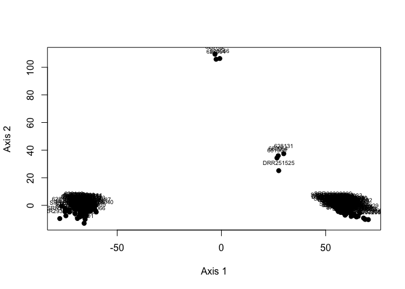<!-- -->

``` r
var_explained <- pcoa_all$eig / sum(pcoa_all$eig) * 100

pc1_lab <- sprintf("Axis 1 (%.1f%%)", var_explained[1])
pc2_lab <- sprintf("Axis 2 (%.1f%%)", var_explained[2])
```

And here’s how I calculated the statistics for the full genomes, plus
control region only, and everything except for control region.

``` r
# Haplotype diversity
hap.div(all_mt)
```

    ## [1] 0.9990581

``` r
# Nucleotide diversity
nuc.div(all_mt)
```

    ## [1] 0.004455232

``` r
nrow(all_mt)
```

    ## [1] 196

``` r
# Number of haplotypes
haps_all_mt <- haplotype(all_mt)
nrow(haps_all_mt)
```

    ## [1] 185

``` r
#Tajima's D
tajima.test(all_mt)
```

    ## $D
    ## [1] -0.9415862
    ## 
    ## $Pval.normal
    ## [1] 0.3464045
    ## 
    ## $Pval.beta
    ## [1] 0.361933

``` r
all_mt_control_only <- read.dna("02_Mitogenomes_local/All_incl_ERR_DRR_control_only.fasta", format = "fasta")

# Haplotype diversity
hap.div(all_mt_control_only)
```

    ## [1] 0.9987441

``` r
# Nucleotide diversity
nuc.div(all_mt_control_only)
```

    ## [1] 0.0156473

``` r
# Number of haplotypes
haps_all_mt_control_only <- haplotype(all_mt_control_only)
nrow(haps_all_mt_control_only)
```

    ## [1] 183

``` r
#Tajima's D
tajima.test(all_mt_control_only)
```

    ## $D
    ## [1] -1.53167
    ## 
    ## $Pval.normal
    ## [1] 0.125604
    ## 
    ## $Pval.beta
    ## [1] 0.102118

``` r
all_mt_no_control<- read.dna("02_Mitogenomes_local/All_incl_ERR_DRR_no_control.fasta", format = "fasta")

# Haplotype diversity
hap.div(all_mt_no_control)
```

    ## [1] 0.981528

``` r
# Nucleotide diversity
nuc.div(all_mt_no_control)
```

    ## [1] 0.003505031

``` r
# Number of haplotypes
haps_all_mt_no_control <- haplotype(all_mt_no_control)
nrow(haps_all_mt_no_control)
```

    ## [1] 106

``` r
#Tajima's D
tajima.test(all_mt_no_control)
```

    ## $D
    ## [1] -0.4914
    ## 
    ## $Pval.normal
    ## [1] 0.6231436
    ## 
    ## $Pval.beta
    ## [1] 0.6682558

Australia only:

``` r
mt_ids <- rownames(all_mt)
mt_meta <- dugong_meta %>%
  filter(bioplatforms_library_id %in% mt_ids)

new_row <- mt_meta[1, ]
new_row[,] <- NA

new_row$bioplatforms_library_id <- "DugDug_mtGenome"
new_row$country <- "Australia"

mt_meta <- bind_rows(mt_meta, new_row)

all_mt_aus <- all_mt[
  rownames(all_mt) %in%
    mt_meta$bioplatforms_library_id[mt_meta$country == "Australia"],
]

# Sample size
nrow(all_mt_aus)
```

    ## [1] 181

``` r
# Haplotype diversity
hap.div(all_mt_aus)
```

    ## [1] 0.998895

``` r
# Nucleotide diversity
nuc.div(all_mt_aus)
```

    ## [1] 0.004280321

``` r
# Number of haplotypes
haps_aus <- haplotype(all_mt_aus)
nrow(haps_aus)
```

    ## [1] 170

``` r
# Tajima's D
tajima.test(all_mt_aus)
```

    ## $D
    ## [1] -0.683747
    ## 
    ## $Pval.normal
    ## [1] 0.494135
    ## 
    ## $Pval.beta
    ## [1] 0.5288262

I then split my data into widespread and restricted group within
Australia (excluding New Caledonian samples!).

``` r
widespread_group <- read.dna("02_Mitogenomes_local/65_samples_widespread.fasta", format = "fasta")

widespread_group <- widespread_group[
  rownames(widespread_group) != "DugDug_mtGenome",
]

# Check sample size
nrow(widespread_group)
```

    ## [1] 65

``` r
# Haplotype diversity
hap.div(widespread_group)
```

    ## [1] 0.9995192

``` r
# Nucleotide diversity
nuc.div(widespread_group)
```

    ## [1] 0.00122584

``` r
# Number of haplotypes
haps_widespread_group <- haplotype(widespread_group)
nrow(haps_widespread_group)
```

    ## [1] 64

``` r
#Tajima's D
tajima.test(widespread_group)
```

    ## $D
    ## [1] -2.258363
    ## 
    ## $Pval.normal
    ## [1] 0.02392301
    ## 
    ## $Pval.beta
    ## [1] 0.006198035

``` r
restricted_group <- read.dna("02_Mitogenomes_local/86_samples_restricted.fasta", format = "fasta")

# Haplotype diversity
hap.div(restricted_group)
```

    ## [1] 0.9975942

``` r
# Nucleotide diversity
nuc.div(restricted_group)
```

    ## [1] 0.001057867

``` r
# Number of haplotypes
haps_restricted_group <- haplotype(restricted_group)
nrow(haps_restricted_group)
```

    ## [1] 81

``` r
#Tajima's D
tajima.test(restricted_group)
```

    ## $D
    ## [1] -2.054743
    ## 
    ## $Pval.normal
    ## [1] 0.03990383
    ## 
    ## $Pval.beta
    ## [1] 0.01723072

And then just to check, ran a PCOA on the separate groups.

``` r
dist_wide <- dist.dna(
  widespread_group,
  model = "TN93",   #based on iqtree
  pairwise.deletion = TRUE
)

pcoa_wide <- pcoa(dist_wide)

pcoa_df <- data.frame(
  Sample = rownames(pcoa_wide$vectors),
  PC1 = pcoa_wide$vectors[,1],
  PC2 = pcoa_wide$vectors[,2]
)

pcoa_df_wide <- data.frame(
  bioplatforms_library_id = rownames(pcoa_wide$vectors),
  PC1 = pcoa_wide$vectors[, 1],
  PC2 = pcoa_wide$vectors[, 2],
  stringsAsFactors = FALSE
)

pcoa_df_wide <- pcoa_df_wide %>%
  left_join(
    dugong_meta %>%
      select(bioplatforms_library_id, location_text, country),
    by = "bioplatforms_library_id"
  )

pcoa_df_wide <- pcoa_df_wide %>%
  mutate(
    location_text = ifelse(
      bioplatforms_library_id == "DugDug_mtGenome",
      "Moreton Bay",
      location_text
    ),
    country = ifelse(
      bioplatforms_library_id == "DugDug_mtGenome",
      "Australia",
      country
    )
  )

ggplot(pcoa_df_wide, aes(PC1, PC2, colour = location_text)) +
  geom_point(size = 2, alpha = 0.9) +
  scale_colour_manual(values = all_location_cols, drop = FALSE) +
  theme_classic() +
  labs(
    x = paste0(
      "PCoA 1 (",
      round(pcoa_wide$values$Relative_eig[1] * 100, 1),
      "%)"
    ),
    y = paste0(
      "PCoA 2 (",
      round(pcoa_wide$values$Relative_eig[2] * 100, 1),
      "%)"
    ),
    colour = "Location"
  )
```

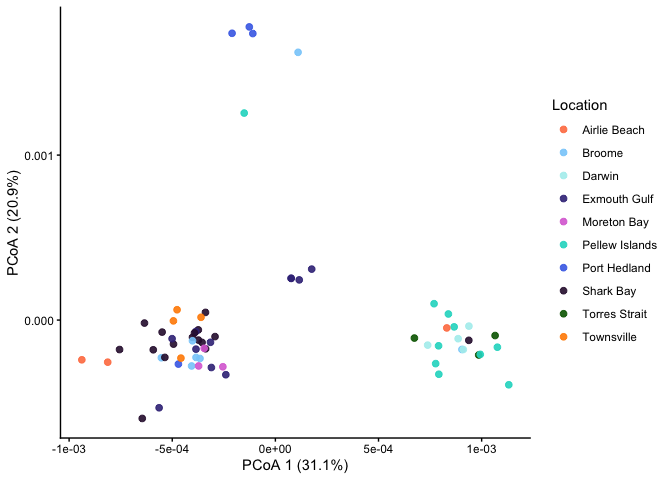<!-- -->

``` r
dist_restr <- dist.dna(
  restricted_group,
  model = "F84",   #based on iqtree it's HKY, but this seems the closest of the available models
  pairwise.deletion = TRUE
)

pcoa_restr <- pcoa(dist_restr)

pcoa_df_restr <- data.frame(
  Sample = rownames(pcoa_restr$vectors),
  PC1 = pcoa_restr$vectors[,1],
  PC2 = pcoa_restr$vectors[,2]
)


pcoa_df_restr <- data.frame(
  bioplatforms_library_id = rownames(pcoa_restr$vectors),
  PC1 = pcoa_restr$vectors[, 1],
  PC2 = pcoa_restr$vectors[, 2],
  PC3 = pcoa_restr$vectors[, 3],
  stringsAsFactors = FALSE
)

pcoa_df_restr <- pcoa_df_restr %>%
  left_join(
    dugong_meta %>%
      select(bioplatforms_library_id, location_text, country),
    by = "bioplatforms_library_id"
  )

pcoa_df_restr <- pcoa_df_restr %>%
  mutate(
    location_text = ifelse(
      bioplatforms_library_id == "DugDug_mtGenome",
      "Moreton Bay",
      location_text
    ),
    country = ifelse(
      bioplatforms_library_id == "DugDug_mtGenome",
      "Australia",
      country
    )
  )

ggplot(pcoa_df_restr, aes(PC1, PC2, colour = location_text)) +
  geom_point(size = 2, alpha = 0.9) +
  scale_colour_manual(values = all_location_cols, drop = FALSE) +
  theme_classic() +
  labs(
    x = paste0(
      "PCoA 1 (",
      round(pcoa_restr$values$Relative_eig[1] * 100, 1),
      "%)"
    ),
    y = paste0(
      "PCoA 2 (",
      round(pcoa_restr$values$Relative_eig[2] * 100, 1),
      "%)"
    ),
    colour = "Location"
  )
```

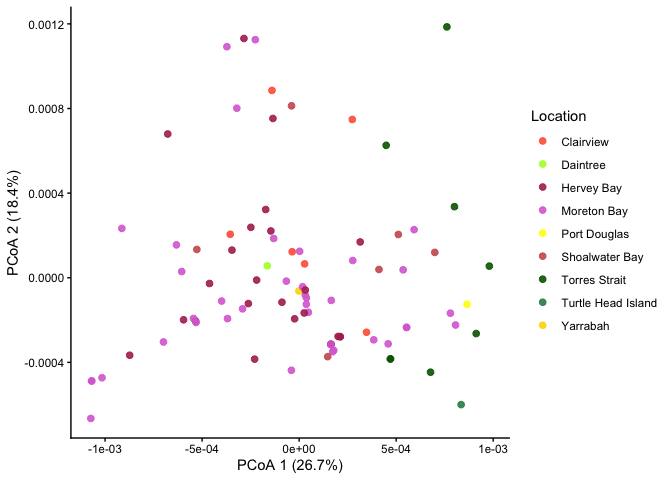<!-- -->

``` r
ggplot(pcoa_df_restr, aes(PC2, PC3, colour = location_text)) +
  geom_point(size = 2, alpha = 0.9) +
  scale_colour_manual(values = all_location_cols, drop = FALSE) +
  theme_classic() +
  labs(
    x = paste0(
      "PCoA 2 (",
      round(pcoa_restr$values$Relative_eig[2] * 100, 1),
      "%)"
    ),
    y = paste0(
      "PCoA 3 (",
      round(pcoa_restr$values$Relative_eig[3] * 100, 1),
      "%)"
    ),
    colour = "Location"
  )
```

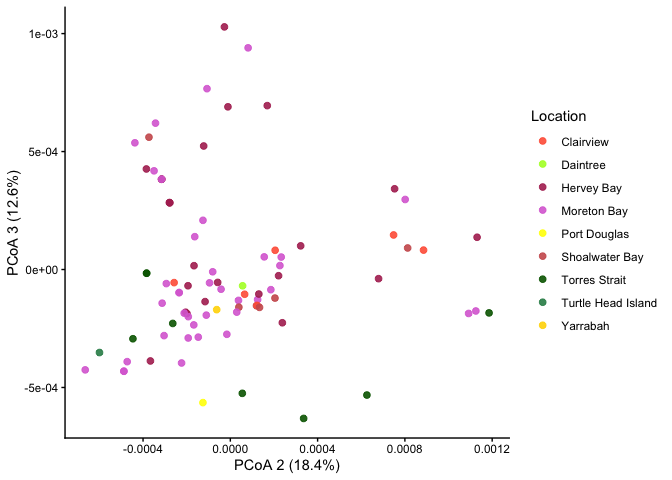<!-- -->

``` r
pcoa_df_all <- data.frame(
  bioplatforms_library_id = rownames(pcoa_all$points),
  PC1 = pcoa_all$points[, 1],
  PC2 = pcoa_all$points[, 2],
  stringsAsFactors = FALSE
) %>%
  left_join(
    dugong_meta %>%
      select(bioplatforms_library_id, location_text, country),
    by = "bioplatforms_library_id"
  ) %>%
  mutate(
    # Fix reference sample
    location_text = ifelse(
      bioplatforms_library_id == "DugDug_mtGenome",
      "Moreton Bay",
      location_text
    ),
    country = ifelse(
      bioplatforms_library_id == "DugDug_mtGenome",
      "Australia",
      country
    ),

    # FINAL plotting variable 
    plot_location = case_when(
      country == "Australia" ~ location_text,
      country == "UAE" ~ "UAE",
      country == "Palau" ~ "Palau",
      country == "Malaysia" ~ "Malaysia",
      country == "Japan" ~ "Japan",
      country == "New Caledonia" ~ "New Caledonia",
      TRUE ~ NA_character_
    )
  )

pcoa_df_all$plot_location <- factor(
  pcoa_df_all$plot_location,
  levels = names(all_location_cols)
)

non_aus <- c("UAE","Palau","Malaysia","Japan","New Caledonia")

shape_values <- setNames(
  ifelse(names(all_location_cols) %in% non_aus, 15, 16),
  names(all_location_cols)
)

pcoa_aus <- pcoa_df_all %>%
  filter(country == "Australia")

pcoa_non_aus <- pcoa_df_all %>%
  filter(country != "Australia")

final_plot <- ggplot() +
  ## Australian samples: circles
  geom_point(
    data = pcoa_aus,
    aes(PC1, PC2, colour = plot_location),
    size = 3,
    shape = 16
  ) +
  ## Non-Australian samples: squares
  geom_point(
    data = pcoa_non_aus,
    aes(PC1, PC2, colour = plot_location),
    size = 3,
    shape = 15
  ) +
  scale_colour_manual(values = all_location_cols, drop = FALSE) +
  theme_classic() +
  labs(
    x = pc1_lab,
    y = pc2_lab,
    colour = "Location"
  )

final_plot
```

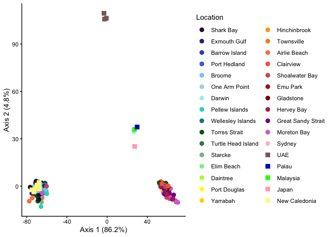<!-- -->

``` r
d <- dist.dna(all_mt, model = "N", pairwise.deletion = TRUE)

pcoa_full <- cmdscale(d, k = 2, eig = TRUE)

pcoa_df_full <- data.frame(
  bioplatforms_library_id = rownames(pcoa_full$points),
  PC1 = pcoa_full$points[, 1],
  PC2 = pcoa_full$points[, 2],
  stringsAsFactors = FALSE
)

#ggsave(
#  filename = "pcoa_plot.png",
#  plot = final_plot,
#  width = 250,
#  height = 160,
#  units = "mm",
#  dpi = 600
#)
```

Then I made a traits file for popart for the whole mitochondrial genome,
the mitochondrial genome with just the control region, and the
mitochondrial genome without the control region.

``` r
whole_mt <- read.nexus.data("02_Mitogenomes_local/All_incl_ERR_DRR.nex")

sample_names <- names(whole_mt)

traits_for_popart_full <- data.frame(
  ID = sample_names
) %>%
  left_join(
    dugong_meta %>%
      select(
        bioplatforms_library_id,
        location_text
      ),
    by = c("ID" = "bioplatforms_library_id")
  ) %>%
  rename(
    Region = location_text
  ) %>%
  mutate(
    Region = ifelse(
      ID == "DugDug_mtGenome",
      "Moreton Bay",
      Region
    )
  )

traits_for_popart_full %>%
  filter(is.na(Region))
```

    ## [1] ID     Region
    ## <0 rows> (or 0-length row.names)

``` r
traits_for_popart_full <- traits_for_popart_full %>%
  mutate(
    Region = gsub(" ", "_", Region)
  )

trait_matrix <- traits_for_popart_full %>%
  mutate(value = 1) %>%
  pivot_wider(
    names_from = Region,
    values_from = value,
    values_fill = 0
  )


locations <- colnames(trait_matrix)[-1]

out_file <- "traits_block.txt"

con <- file(out_file, open = "w")

cat("BEGIN TRAITS;\n", file = con)

cat(
  "Dimensions NTRAITS=",
  length(locations),
  ";\n",
  sep = "",
  file = con
)

cat(
  "Format labels=yes missing=? separator=Comma;\n",
  file = con
)

cat(
  "TraitLabels ",
  paste(locations, collapse = " "),
  ";\n",
  sep = "",
  file = con
)

cat("Matrix\n", file = con)

apply(trait_matrix, 1, function(row) {

  cat(
    row[1],
    " ",
    paste(row[-1], collapse = ","),
    "\n",
    sep = "",
    file = con
  )

})
```

    ## NULL

``` r
cat(";\nEND;\n", file = con)

close(con)
```

And now link those results back to the metadata.

``` r
popart_edges <- read_tsv(
  "02_Mitogenomes_local/All_incl_ERR_DRR_traits.txt",
  col_names = c("from", "steps", "to")
)
```

    ## Rows: 338 Columns: 3
    ## ── Column specification ────────────────────────────────────────────────────────
    ## Delimiter: "\t"
    ## chr (2): from, to
    ## dbl (1): steps
    ## 
    ## ℹ Use `spec()` to retrieve the full column specification for this data.
    ## ℹ Specify the column types or set `show_col_types = FALSE` to quiet this message.

``` r
meta_lookup <- dugong_meta %>%
  select(
    bioplatforms_library_id,
    location_text
  ) %>%
  distinct()

annotated_edges <- popart_edges %>%

  left_join(
    meta_lookup,
    by = c("from" = "bioplatforms_library_id")
  ) %>%
  rename(
    from_location = location_text
  ) %>%

  left_join(
    meta_lookup,
    by = c("to" = "bioplatforms_library_id")
  ) %>%
  rename(
    to_location = location_text
  )

annotated_edges
```

    ## # A tibble: 338 × 5
    ##    from        steps to          from_location to_location  
    ##    <chr>       <dbl> <chr>       <chr>         <chr>        
    ##  1 SRR29329050     1 SRR29328990 Moreton Bay   Hervey Bay   
    ##  2 628133          1 SRR29328990 Gladstone     Hervey Bay   
    ##  3 SRR29329060     1 SRR29329054 Clairview     Moreton Bay  
    ##  4 628114          1 628103      Exmouth Gulf  Exmouth Gulf 
    ##  5 628138          1 SRR29329040 Yarrabah      Clairview    
    ##  6 628086          1 SRR29328998 Townsville    Townsville   
    ##  7 628061          1 681989      Broome        Shark Bay    
    ##  8 628095          1 628062      Shark Bay     Shark Bay    
    ##  9 SRR29329045     1 SRR29328968 Moreton Bay   Moreton Bay  
    ## 10 181             1 682043      <NA>          New Caledonia
    ## # ℹ 328 more rows

``` r
sample_summary <- bind_rows(

  annotated_edges %>%
    select(ID = from, Location = from_location),

  annotated_edges %>%
    select(ID = to, Location = to_location)

) %>%
  filter(!is.na(Location)) %>%
  distinct()

sample_summary
```

    ## # A tibble: 180 × 2
    ##    ID          Location    
    ##    <chr>       <chr>       
    ##  1 SRR29329050 Moreton Bay 
    ##  2 628133      Gladstone   
    ##  3 SRR29329060 Clairview   
    ##  4 628114      Exmouth Gulf
    ##  5 628138      Yarrabah    
    ##  6 628086      Townsville  
    ##  7 628061      Broome      
    ##  8 628095      Shark Bay   
    ##  9 SRR29329045 Moreton Bay 
    ## 10 SRR29329041 Moreton Bay 
    ## # ℹ 170 more rows

Now for the mitochondrial genome without the control region.

``` r
no_contr <- read.nexus.data("02_Mitogenomes_local/All_incl_ERR_DRR_no_control.nex")

sample_names <- names(no_contr)

traits_for_popart_full <- data.frame(
  ID = sample_names
) %>%
  left_join(
    dugong_meta %>%
      select(
        bioplatforms_library_id,
        location_text
      ),
    by = c("ID" = "bioplatforms_library_id")
  ) %>%
  rename(
    Region = location_text
  ) %>%
  mutate(
    Region = ifelse(
      ID == "DugDug_mtGenome",
      "Moreton Bay",
      Region
    )
  )

traits_for_popart_full %>%
  filter(is.na(Region))
```

    ## [1] ID     Region
    ## <0 rows> (or 0-length row.names)

``` r
traits_for_popart_full <- traits_for_popart_full %>%
  mutate(
    Region = gsub(" ", "_", Region)
  )

trait_matrix <- traits_for_popart_full %>%
  mutate(value = 1) %>%
  pivot_wider(
    names_from = Region,
    values_from = value,
    values_fill = 0
  )


locations <- colnames(trait_matrix)[-1]

out_file <- "traits_block_no_control.txt"

con <- file(out_file, open = "w")

cat("BEGIN TRAITS;\n", file = con)

cat(
  "Dimensions NTRAITS=",
  length(locations),
  ";\n",
  sep = "",
  file = con
)

cat(
  "Format labels=yes missing=? separator=Comma;\n",
  file = con
)

cat(
  "TraitLabels ",
  paste(locations, collapse = " "),
  ";\n",
  sep = "",
  file = con
)

cat("Matrix\n", file = con)

apply(trait_matrix, 1, function(row) {

  cat(
    row[1],
    " ",
    paste(row[-1], collapse = ","),
    "\n",
    sep = "",
    file = con
  )

})
```

    ## NULL

``` r
cat(";\nEND;\n", file = con)

close(con)
```

Now the same thing just with the control region only.

``` r
control_region <- read.dna(
  "02_Mitogenomes_local/All_incl_ERR_DRR_control_only.fasta",
  format = "fasta"
)

sample_names <- rownames(control_region)

traits_for_popart_control <- data.frame(
  ID = sample_names
) %>%
  left_join(
    dugong_meta %>%
      select(
        bioplatforms_library_id,
        location_text
      ),
    by = c("ID" = "bioplatforms_library_id")
  ) %>%
  rename(
    Region = location_text
  ) %>%
  mutate(
    Region = ifelse(
      ID == "DugDug_mtGenome",
      "Moreton Bay",
      Region
    )
  )


traits_for_popart_control %>%
  filter(is.na(Region))
```

    ## [1] ID     Region
    ## <0 rows> (or 0-length row.names)

``` r
traits_for_popart_control <- traits_for_popart_control %>%
  mutate(
    Region = gsub(" ", "_", Region)
  )


trait_matrix <- traits_for_popart_control %>%
  mutate(value = 1) %>%
  pivot_wider(
    names_from = Region,
    values_from = value,
    values_fill = 0
  )

locations <- colnames(trait_matrix)[-1]

out_file <- "02_Mitogenomes_local/traits_block_control_only.txt"

con <- file(out_file, open = "w")

cat("BEGIN TRAITS;\n", file = con)

cat(
  "Dimensions NTRAITS=",
  length(locations),
  ";\n",
  sep = "",
  file = con
)

cat(
  "Format labels=yes missing=? separator=Comma;\n",
  file = con
)

cat(
  "TraitLabels ",
  paste(locations, collapse = " "),
  ";\n",
  sep = "",
  file = con
)

cat("Matrix\n", file = con)

apply(trait_matrix, 1, function(row) {

  cat(
    row[1],
    " ",
    paste(row[-1], collapse = ","),
    "\n",
    sep = "",
    file = con
  )

})
```

    ## NULL

``` r
cat(";\nEND;\n", file = con)

close(con)
```

Now I’m looking at where the differences are along the mitochondrial
genome exactly.

``` r
mt_DNA <- read.dna("02_Mitogenomes_local/All_incl_ERR_DRR.fasta",
                format = "fasta")

bed <- read.table("02_Mitogenomes_local/Dugong_mito_genome.bed",
                  header = FALSE,
                  stringsAsFactors = FALSE)

colnames(bed) <- c("chrom",
                   "start",
                   "end",
                   "gene",
                   "score",
                   "strand")
```

``` r
seg_sites <- seg.sites(mt_DNA)

length(seg_sites)
```

    ## [1] 651

``` r
head(seg_sites)
```

    ## [1]  17 158 162 207 225 250

``` r
snp_df <- data.frame(position = seg_sites)

snp_df$gene <- NA

for(i in 1:nrow(bed)) {

  idx <- snp_df$position >= bed$start[i] &
         snp_df$position <= bed$end[i]

  snp_df$gene[idx] <- bed$gene[i]
}

head(snp_df)
```

    ##   position  gene
    ## 1       17 trnaF
    ## 2      158  rrnS
    ## 3      162  rrnS
    ## 4      207  rrnS
    ## 5      225  rrnS
    ## 6      250  rrnS

``` r
gene_counts <- snp_df %>%
  group_by(gene) %>%
  summarise(n_snps = n()) %>%
  arrange(desc(n_snps))
```

``` r
window_size <- 200
step_size <- 50

genome_length <- ncol(mt_DNA)

windows <- seq(1,
               genome_length - window_size,
               by = step_size)

snp_counts <- sapply(windows, function(w) {

  sum(seg_sites >= w &
      seg_sites < (w + window_size))
})

plot_df <- data.frame(
  position = windows,
  snps = snp_counts
)

ggplot(plot_df,
       aes(position, snps)) +

  geom_line() +

  theme_bw() +

  labs(x = "Mitogenome position",
       y = "SNPs per 200 bp window")
```

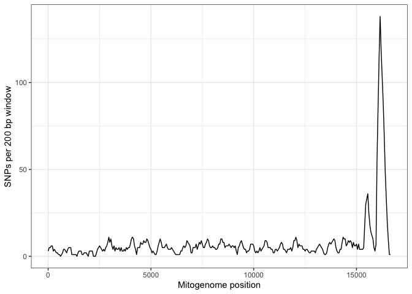<!-- -->

``` r
samples_widespread <- pcoa_df_full %>%
  filter(PC1 < -40)
samples_restricted <- pcoa_df_full %>%
  filter(PC1 > 40)

restricted_ids <- samples_restricted$bioplatforms_library_id
widespread_ids <- samples_widespread$bioplatforms_library_id

rownames(mt_DNA)[1:10]
```

    ##  [1] "DugDug_mtGenome" "682056"          "SRR29328990"     "SRR29328970"    
    ##  [5] "628101"          "SRR29329043"     "SRR29329041"     "SRR29329065"    
    ##  [9] "628122"          "628073"

``` r
sum(restricted_ids %in% rownames(mt_DNA))
```

    ## [1] 100

``` r
sum(widespread_ids %in% rownames(mt_DNA))
```

    ## [1] 89

``` r
dna_matrix <- as.character(mt_DNA)

restricted_ids <- restricted_ids[
  restricted_ids %in% rownames(dna_matrix)
]

widespread_ids <- widespread_ids[
  widespread_ids %in% rownames(dna_matrix)
]
```

``` r
fixed_sites <- c()

for(pos in 1:ncol(dna_matrix)) {

  restricted_bases <- unique(
    dna_matrix[restricted_ids, pos]
  )

  widespread_bases <- unique(
    dna_matrix[widespread_ids, pos]
  )

  restricted_bases <- setdiff(
    restricted_bases,
    c("-", "n", "N", "?")
  )

  widespread_bases <- setdiff(
    widespread_bases,
    c("-", "n", "N", "?")
  )

  if(length(restricted_bases) == 1 &
     length(widespread_bases) == 1 &
     restricted_bases[1] != widespread_bases[1]) {

    fixed_sites <- c(fixed_sites, pos)
  }
}

length(fixed_sites)
```

    ## [1] 87

``` r
head(fixed_sites)
```

    ## [1]  158  207  381  934  937 1146

``` r
control_region <- data.frame(
  chrom = "Dugong_mito_genome",
  start = 15432,
  end = ncol(dna_matrix),
  gene = "control_region",
  score = 1,
  strand = "+"
)

bed2 <- rbind(bed, control_region)

fixed_df <- data.frame(
  position = fixed_sites
)

fixed_df$gene <- NA

for(i in 1:nrow(bed2)) {

  idx <- fixed_df$position >= bed2$start[i] &
         fixed_df$position <= bed2$end[i]

  fixed_df$gene[idx] <- bed2$gene[i]
}

fixed_summary <- fixed_df %>%
  group_by(gene) %>%
  summarise(n_fixed = n()) %>%
  arrange(desc(n_fixed))

fixed_summary
```

    ## # A tibble: 20 × 2
    ##    gene           n_fixed
    ##    <chr>            <int>
    ##  1 nad5                17
    ##  2 control_region       9
    ##  3 nad2                 9
    ##  4 nad4                 9
    ##  5 cox1                 6
    ##  6 atp6                 5
    ##  7 nad1                 5
    ##  8 nad6                 5
    ##  9 rrnS                 5
    ## 10 cox2                 3
    ## 11 cob                  2
    ## 12 cox3                 2
    ## 13 nad3                 2
    ## 14 rrnL                 2
    ## 15 atp8                 1
    ## 16 nad4l                1
    ## 17 trnaA                1
    ## 18 trnaL2               1
    ## 19 trnaS2               1
    ## 20 trnaW                1

``` r
window_size <- 100
step_size <- 10

windows <- seq(
  1,
  ncol(dna_matrix) - window_size,
  by = step_size
)

fixed_counts <- sapply(windows, function(w) {

  sum(fixed_sites >= w &
      fixed_sites < (w + window_size))
})

mini_windows <- data.frame(
  start = windows,
  end = windows + window_size,
  fixed_diffs = fixed_counts
)

mini_windows %>%
  arrange(desc(fixed_diffs)) %>%
  head(20)
```

    ##    start   end fixed_diffs
    ## 1  15511 15611           5
    ## 2  15521 15621           5
    ## 3  15531 15631           5
    ## 4  15541 15641           5
    ## 5  15551 15651           5
    ## 6  15561 15661           5
    ## 7  15571 15671           5
    ## 8  15581 15681           5
    ## 9  12041 12141           4
    ## 10 12051 12151           4
    ## 11 12061 12161           4
    ## 12 12071 12171           4
    ## 13 15501 15601           4
    ## 14 15591 15691           4
    ## 15  5481  5581           3
    ## 16  5491  5591           3
    ## 17  5501  5601           3
    ## 18 11801 11901           3
    ## 19 12011 12111           3
    ## 20 12021 12121           3

So most of these are in the control region, but some are in the NAD
region, which is a coding region!

``` r
candidate_start <- 12040
candidate_end <- 12170

restricted_consensus <- apply(
  dna_matrix[restricted_ids,
             candidate_start:candidate_end],
  2,
  function(x) {
    names(sort(table(x),
               decreasing = TRUE))[1]
  }
)

widespread_consensus <- apply(
  dna_matrix[widespread_ids,
             candidate_start:candidate_end],
  2,
  function(x) {
    names(sort(table(x),
               decreasing = TRUE))[1]
  }
)

diagnostic_snps <- data.frame(
  position = candidate_start:candidate_end,
  restricted = restricted_consensus,
  widespread = widespread_consensus
)

diagnostic_snps <- diagnostic_snps %>%
  filter(restricted != widespread)

diagnostic_snps
```

    ##   position restricted widespread
    ## 1    12073          g          a
    ## 2    12089          t          c
    ## 3    12108          t          c
    ## 4    12140          g          a

``` r
window_size <- 200
step_size <- 50

windows <- seq(
  1,
  ncol(dna_matrix) - window_size,
  by = step_size
)

fixed_counts <- sapply(windows, function(w) {

  sum(fixed_sites >= w &
      fixed_sites < (w + window_size))
})

fixed_plot <- data.frame(
  position = windows,
  fixed_diffs = fixed_counts
)

ggplot(fixed_plot,
       aes(position, fixed_diffs)) +

  geom_line(linewidth = 1) +

  theme_bw() +

  labs(
    x = "Mitogenome position",
    y = "Fixed differences"
  )
```

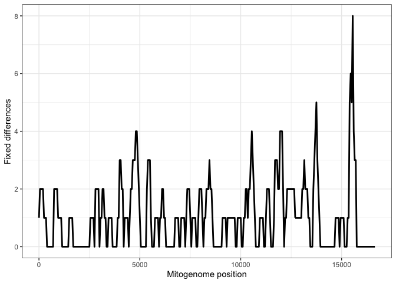<!-- -->

``` r
mean(fixed_df$gene == "control_region")
```

    ## [1] 0.1034483

Now I want to see whether there is a similar story with the other
groups, not just widespread vs restricted within Australia.

``` r
uae_ids <- c(
  "628132",
  "628054",
  "628066"
)

other_ids <- c(
  "DRR251525",
  "682064",
  "628131",
  "681968"
)

coding_positions <- 1:15431

dna_matrix <- as.character(mt_DNA)[, coding_positions]

group_list <- list(
  widespread = widespread_ids,
  restricted = restricted_ids,
  uae = uae_ids,
  other = other_ids
)

diagnostic_sites <- list()

for(pos in 1:ncol(dna_matrix)) {

  group_consensus <- c()

  valid_site <- TRUE

  for(g in names(group_list)) {

    ids <- group_list[[g]]

    ids <- ids[ids %in% rownames(dna_matrix)]

    bases <- unique(
      dna_matrix[ids, pos]
    )

    bases <- setdiff(
      bases,
      c("-", "N", "n", "?")
    )

    if(length(bases) != 1) {

      valid_site <- FALSE
      break
    }

    group_consensus[g] <- bases
  }

  if(valid_site &&
     length(unique(group_consensus)) > 1) {

    diagnostic_sites[[length(diagnostic_sites)+1]] <-
      data.frame(
        position = pos,
        widespread = group_consensus["widespread"],
        restricted = group_consensus["restricted"],
        uae = group_consensus["uae"],
        other = group_consensus["other"]
      )
  }
}

diagnostic_df <- do.call(rbind,
                         diagnostic_sites)
```

``` r
diagnostic_df$gene <- NA

for(i in 1:nrow(bed)) {

  idx <- diagnostic_df$position >= bed$start[i] &
         diagnostic_df$position <= bed$end[i]

  diagnostic_df$gene[idx] <- bed$gene[i]
}

diagnostic_summary <- diagnostic_df %>%
  group_by(gene) %>%
  summarise(n_diag = n()) %>%
  arrange(desc(n_diag))

diagnostic_summary
```

    ## # A tibble: 21 × 2
    ##    gene  n_diag
    ##    <chr>  <int>
    ##  1 nad5      25
    ##  2 nad4      16
    ##  3 nad2      12
    ##  4 cob       10
    ##  5 nad1      10
    ##  6 cox1       8
    ##  7 nad6       8
    ##  8 cox3       6
    ##  9 atp6       5
    ## 10 cox2       5
    ## # ℹ 11 more rows

``` r
group_list <- lapply(group_list, function(ids) {

  intersect(ids,
            rownames(dna_matrix))
})

sapply(group_list, length)
```

    ## widespread restricted        uae      other 
    ##         89        100          3          4

``` r
private_sites <- list()


for(target_group in names(group_list)) {

  target_ids <- group_list[[target_group]]

  # Skip empty groups
  if(length(target_ids) == 0) {
    next
  }

  private_positions <- c()

  for(pos in 1:ncol(dna_matrix)) {

    # TARGET BASES
    target_bases <- unique(
      dna_matrix[target_ids, pos, drop = TRUE]
    )

    target_bases <- setdiff(
      target_bases,
      c("-", "N", "n", "?")
    )

    # Must be fixed within lineage
    if(length(target_bases) != 1) {
      next
    }

    target_base <- target_bases[1]

    # OTHER IDS
    other_ids <- unlist(
      group_list[
        names(group_list) != target_group
      ]
    )

    other_ids <- intersect(
      other_ids,
      rownames(dna_matrix)
    )

    # Skip if no comparison samples
    if(length(other_ids) == 0) {
      next
    }

    other_bases <- unique(
      dna_matrix[other_ids, pos, drop = TRUE]
    )

    other_bases <- setdiff(
      other_bases,
      c("-", "N", "n", "?")
    )

    # PRIVATE SNPs
    if(!(target_base %in% other_bases)) {

      private_positions <- c(
        private_positions,
        pos
      )
    }
  }

  private_sites[[target_group]] <- private_positions
}

private_summary <- data.frame(
  lineage = names(private_sites),
  private_diagnostic_snps =
    sapply(private_sites, length)
)

private_summary
```

    ##               lineage private_diagnostic_snps
    ## widespread widespread                      37
    ## restricted restricted                      24
    ## uae               uae                      45
    ## other           other                       9

``` r
private_df <- data.frame(
  lineage = rep(
    names(private_sites),
    sapply(private_sites, length)
  ),
  position = unlist(private_sites)
)

uae_df <- private_df %>%
  filter(lineage == "uae")

ggplot(uae_df,
       aes(position)) +

  geom_histogram(binwidth = 200) +

  theme_bw() +

  labs(
    x = "Mitogenome position",
    y = "Private UAE SNPs"
  )
```

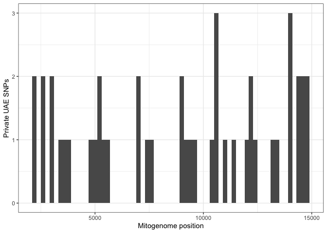<!-- -->

``` r
diag_positions <- diagnostic_df$position

window_size <- 100
step_size <- 10

windows <- seq(
  1,
  ncol(dna_matrix) - window_size,
  by = step_size
)

diag_counts <- sapply(windows, function(w) {

  sum(diag_positions >= w &
      diag_positions < (w + window_size))
})

mini_windows <- data.frame(
  start = windows,
  end = windows + window_size,
  diagnostic_snps = diag_counts
)

mini_windows %>%
  arrange(desc(diagnostic_snps)) %>%
  head(20)
```

    ##    start   end diagnostic_snps
    ## 1   4841  4941               5
    ## 2   4851  4951               5
    ## 3   4861  4961               5
    ## 4  10601 10701               5
    ## 5  10611 10711               5
    ## 6  10641 10741               5
    ## 7  10651 10751               5
    ## 8  12041 12141               5
    ## 9  12051 12151               5
    ## 10 12071 12171               5
    ## 11  2971  3071               4
    ## 12  4811  4911               4
    ## 13  4821  4921               4
    ## 14  4831  4931               4
    ## 15  4871  4971               4
    ## 16  4881  4981               4
    ## 17  4891  4991               4
    ## 18  4901  5001               4
    ## 19 10561 10661               4
    ## 20 10571 10671               4

``` r
inspect_region <- function(start_pos,
                           end_pos,
                           dna_matrix,
                           group_list) {

  get_consensus <- function(ids) {

    apply(
      dna_matrix[ids,
                 start_pos:end_pos,
                 drop = FALSE],
      2,
      function(x) {

        x <- x[!x %in%
                 c("-", "N", "n", "?")]

        if(length(x) == 0) {
          return(NA)
        }

        names(sort(table(x),
                   decreasing = TRUE))[1]
      }
    )
  }

  consensus_df <- data.frame(
    position = start_pos:end_pos
  )

  for(g in names(group_list)) {

    ids <- intersect(
      group_list[[g]],
      rownames(dna_matrix)
    )

    consensus_df[[g]] <- get_consensus(ids)
  }

  consensus_df %>%

    rowwise() %>%

    mutate(
      n_unique = length(
        unique(
          na.omit(
            c_across(-position)
          )
        )
      )
    ) %>%

    ungroup() %>%

    filter(n_unique > 1)
}
```

``` r
nd5_region <- inspect_region(
  start_pos = 12041,
  end_pos = 12171,
  dna_matrix = dna_matrix,
  group_list = group_list
)

nd5_region
```

    ## # A tibble: 6 × 6
    ##   position widespread restricted uae   other n_unique
    ##      <int> <chr>      <chr>      <chr> <chr>    <int>
    ## 1    12059 a          a          g     a            2
    ## 2    12073 a          g          g     g            2
    ## 3    12089 c          t          t     t            2
    ## 4    12108 c          t          t     t            2
    ## 5    12140 a          g          a     g            2
    ## 6    12165 c          c          t     c            2

``` r
nd4_region <- inspect_region(
  start_pos = 10601,
  end_pos = 10751,
  dna_matrix = dna_matrix,
  group_list = group_list
)

nd4_region
```

    ## # A tibble: 7 × 6
    ##   position widespread restricted uae   other n_unique
    ##      <int> <chr>      <chr>      <chr> <chr>    <int>
    ## 1    10618 c          t          c     c            2
    ## 2    10630 g          g          a     g            2
    ## 3    10660 g          g          a     g            2
    ## 4    10690 g          g          a     g            2
    ## 5    10693 g          a          g     g            2
    ## 6    10733 g          g          g     a            2
    ## 7    10738 t          c          t     c            2

Now I will map them!

``` r
map_df <- dugong_meta %>%
  mutate(
    decimal_longitude_private = as.numeric(decimal_longitude_private),
    decimal_latitude_private  = as.numeric(decimal_latitude_private),
    plot_location = case_when(
      country == "Australia" ~ location_text,
      country == "UAE" ~ "UAE",
      country == "Palau" ~ "Palau",
      country == "Malaysia" ~ "Malaysia",
      country == "Japan" ~ "Japan",
      country == "New_Caledonia" ~ "New Caledonia",
      TRUE ~ NA_character_
    ),
    shape_group = ifelse(country == "Australia", "Australia", "Outside Australia")
  ) %>%
  filter(!is.na(plot_location))

world <- map_data("world")

map_df_filtered <- map_df %>%
  dplyr::filter(plot_location != "Arcadia Vale")

outside_aus <- c("UAE", "Palau", "Malaysia", "Japan", "New Caledonia")
legend_shapes <- ifelse(
  all_locations_order %in% outside_aus,
  15,  # square
  16   # circle
)

ggplot() +
  borders("world", colour = "grey70", fill = "grey95") +

  geom_point(
    data = map_df_filtered,
    aes(
      x = decimal_longitude_private,
      y = decimal_latitude_private,
      colour = plot_location,
      shape  = shape_group
    ),
    size = 3
  ) +

  scale_colour_manual(
    values = all_location_cols[all_locations_order], 
    breaks = all_locations_order,
    drop = FALSE
  ) +

  scale_shape_manual(
    values = c("Australia" = 16, "Outside Australia" = 15),
    guide = "none"  
  ) +

  coord_sf(
    xlim = c(45, 180),
    ylim = c(-40, 40),
    expand = FALSE
  ) +

  theme_classic() +
  labs(
    x = "Longitude",
    y = "Latitude",
    colour = "Location"
  )
```

    ## Warning: `borders()` was deprecated in ggplot2 4.0.0.
    ## ℹ Please use `annotation_borders()` instead.
    ## This warning is displayed once per session.
    ## Call `lifecycle::last_lifecycle_warnings()` to see where this warning was
    ## generated.

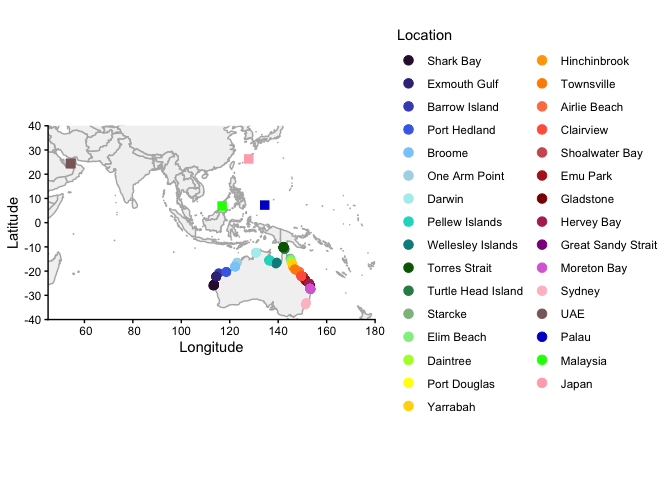<!-- --> And now
a map of widespread vs restricted.

``` r
samples_widespread <- pcoa_df_full %>%
  filter(PC1 < -40) %>%
  mutate(lineage = "Widespread")

samples_restricted <- pcoa_df_full %>%
  filter(PC1 > 40) %>%
  mutate(lineage = "Restricted")

lineage_df <- bind_rows(
  samples_widespread,
  samples_restricted
)
```

``` r
map_lineages <- dugong_meta %>%
  inner_join(
    lineage_df %>%
      select(bioplatforms_library_id, lineage),
    by = "bioplatforms_library_id"
  ) %>%
  mutate(
    decimal_longitude_private =
      as.numeric(decimal_longitude_private),

    decimal_latitude_private =
      as.numeric(decimal_latitude_private)
  ) %>%
  filter(country == "Australia")
```

``` r
ggplot() +

  borders("world",
          colour = "grey70",
          fill = "grey95") +

  geom_point(
  data = map_lineages,
  aes(
    x = decimal_longitude_private,
    y = decimal_latitude_private,
    colour = lineage
  ),
  position = position_jitter(width = 0.3, height = 0.3),
  size = 3
) +

  scale_colour_manual(
    values = c(
      "Restricted" = "#D55E00",
      "Widespread" = "#0072B2"
    )
  ) +

  coord_sf(
    xlim = c(110, 155),
    ylim = c(-40, -8),
    expand = FALSE
  ) +

  theme_classic() +

  labs(
    x = "Longitude",
    y = "Latitude",
    colour = "Mitochondrial lineage"
  )
```

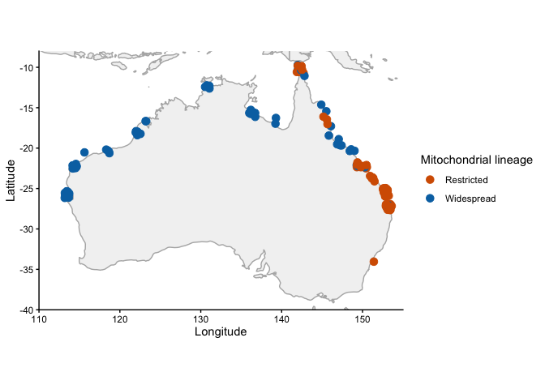<!-- -->

``` r
lineage_summary <- map_lineages %>%
  group_by(location_text, lineage) %>%
  summarise(n = n(), .groups = "drop") %>%
  tidyr::pivot_wider(
    names_from = lineage,
    values_from = n,
    values_fill = 0
  ) %>%
  arrange(location_text)

lineage_summary
```

    ## # A tibble: 27 × 3
    ##    location_text Widespread Restricted
    ##    <chr>              <int>      <int>
    ##  1 Airlie Beach           3          0
    ##  2 Barrow Island          1          0
    ##  3 Broome                 7          0
    ##  4 Clairview              2          6
    ##  5 Daintree               0          1
    ##  6 Darwin                 4          0
    ##  7 Elim Beach             1          0
    ##  8 Emu Park               0          1
    ##  9 Exmouth Gulf          11          0
    ## 10 Gladstone              0          4
    ## # ℹ 17 more rows

Here are the stats for New Caledonia and UAE.

``` r
new_cal <- read.dna("02_Mitogenomes_local/New_Cal_mtDNA_alignment.fasta", format = "fasta")

# Haplotype diversity
hap.div(new_cal)
```

    ## [1] 1

``` r
# Nucleotide diversity
nuc.div(new_cal)
```

    ## [1] 0.0009207556

``` r
# Number of haplotypes
haps_new_cal <- haplotype(new_cal)
nrow(haps_new_cal)
```

    ## [1] 9

``` r
#Tajima's D
tajima.test(new_cal)
```

    ## $D
    ## [1] -1.525038
    ## 
    ## $Pval.normal
    ## [1] 0.1272496
    ## 
    ## $Pval.beta
    ## [1] 0.1102169

``` r
uae <- read.dna("02_Mitogenomes_local/Abu_Dhabi_mtDNA_aligned.fasta", format = "fasta")

# Haplotype diversity
hap.div(uae)
```

    ## [1] 1

``` r
# Nucleotide diversity
nuc.div(uae)
```

    ## [1] 0.0004748056

``` r
# Number of haplotypes
haps_uae <- haplotype(uae)
nrow(haps_uae)
```

    ## [1] 3

``` r
#Tajima's D
tajima.test(uae)
```

    ## Warning in tajima.test(uae): Tajima test requires at least 4 sequences

    ## $D
    ## [1] NaN
    ## 
    ## $Pval.normal
    ## [1] NaN
    ## 
    ## $Pval.beta
    ## [1] NaN

SKYLINE PLOTS!

``` r
skyline <- read_tsv(
  "02_Mitogenomes_local/86_samples_restricted_group_skyline_plot.txt",
  skip = 1,
  col_types = cols()
)

ggplot(skyline, aes(x = time)) +
  geom_ribbon(aes(ymin = lower, ymax = upper),
              fill = "grey80", alpha = 0.6) +
  geom_line(aes(y = mean), linewidth = 1, colour = "black") +
  geom_line(aes(y = median), linewidth = 0.8, linetype = "dashed") +
  scale_x_reverse() +
  theme_bw()
```

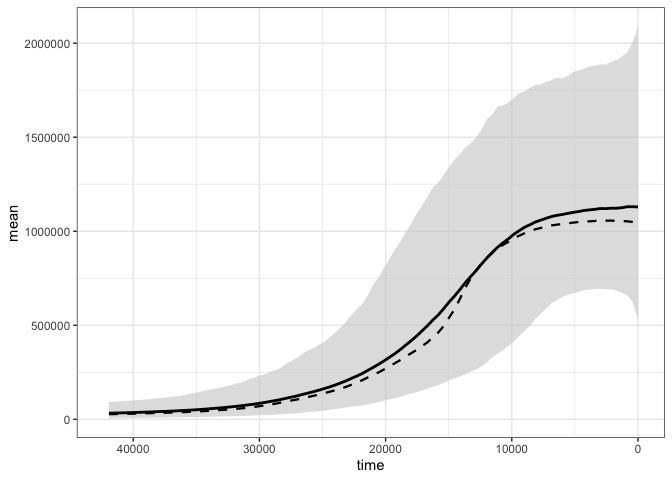<!-- -->

And the sea level data:

``` r
sea_level <- read_tsv(
  "02_Mitogenomes_local/SPRATT2016_SEALEVEL-data.txt",
  comment = "#",
  col_types = cols()
)

sea_level_clean <- sea_level %>%
  mutate(time = age_calkaBP * 1000)

x_limits <- c(41927.65, 0)

p_sea <- ggplot(sea_level_clean, aes(x = time, y = SeaLev_shortPC1)) +
  geom_ribbon(
    aes(
      ymin = SeaLev_shortPC1_err_lo,
      ymax = SeaLev_shortPC1_err_up
    ),
    fill = "steelblue",
    alpha = 0.3
  ) +
  geom_line(linewidth = 1) +
  scale_x_reverse(
    expand = c(0, 0),
    labels = scales::label_number(big.mark = ",")
  ) +
  coord_cartesian(xlim = x_limits) +
  theme_bw() +
  labs(
    x = "Time before present (years)",
    y = "Sea level (m)"
  )

p_sea
```

<!-- -->

``` r
sea_level_clean <- sea_level %>%
  mutate(time = age_calkaBP * 1000)

x_limits <- c(41927.65, 0)

p_sea
```

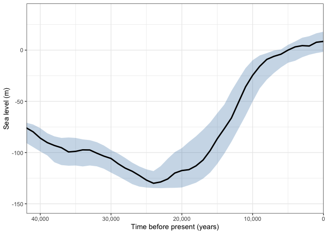<!-- -->

``` r
skyline_r <- read_tsv(
  "02_Mitogenomes_local/restricted_group_70m_data.txt",
  skip = 1,
  col_types = cols()
) %>%
  filter(!is.na(mean), !is.na(time))

skyline_w <- read_tsv(
  "02_Mitogenomes_local/final_widespread_group_data.txt",
  skip = 1,
  col_types = cols()
) %>%
  filter(!is.na(mean), !is.na(time))

x_limits <- c(41927.65, 0)

y_max <- max(skyline_w$upper, na.rm = TRUE)

x_cutoff <- 40000

x_scale <- scale_x_reverse(expand = c(0, 0))
```

``` r
p_widespread <- ggplot(skyline_w, aes(x = time)) +
  geom_ribbon(aes(ymin = lower, ymax = upper),
              fill = "grey80", alpha = 0.7) +
  geom_line(aes(y = mean), linewidth = 1) +
  x_scale +
  coord_cartesian(xlim = c(x_cutoff, 0)) +
  scale_y_continuous(
    labels = scales::label_number(scale = 1e-6, suffix = " m", accuracy = 0.1)
  ) +
  theme_bw() +
  theme(axis.text.x = element_blank(),
        axis.ticks.x = element_blank()) +
  labs(y = expression("Effective population size (" * N[e] * ")"),
       x = NULL) +
  annotate("text",
           x = x_cutoff * 0.97, y = Inf,
           label = "Clade A",
           hjust = 0, vjust = 1.9,
           size = 4, fontface = "bold")


restricted_y_max <- 2.5e6

p_restricted <- ggplot(skyline_r, aes(x = time)) +
  geom_ribbon(aes(ymin = lower, ymax = upper),
              fill = "grey80", alpha = 0.7) +
  geom_line(aes(y = mean), linewidth = 1) +
  x_scale +
  coord_cartesian(xlim = c(x_cutoff, 0)) +
  scale_y_continuous(
    limits = c(0, restricted_y_max),
    labels = scales::label_number(scale = 1e-6, suffix = " m", accuracy = 0.1)
  ) +
  theme_bw() +
  theme(axis.text.x = element_blank(),
        axis.ticks.x = element_blank()) +
  labs(y = expression("Effective population size (" * N[e] * ")"),
       x = NULL) +
  annotate("text",
           x = x_cutoff * 0.97, y = Inf,
           label = "Clade C",
           hjust = 0, vjust = 1.9,
           size = 4, fontface = "bold")


plot_grid(
  p_widespread,
  p_restricted,
  p_sea,
  ncol = 1,
  align = "v",
  axis = "lr",
  rel_heights = c(1, 1, 0.6)
)
```

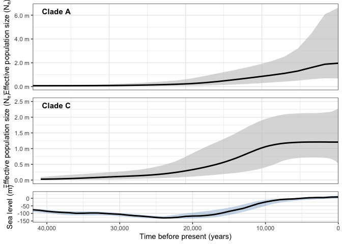<!-- -->

Making a list of all the samples I used.

``` r
pcoa_df_joined <- pcoa_df_full %>%
  inner_join(
    dugong_meta %>%
      select(bioplatforms_library_id, specimen_id...6, collector, collection_date, location_text, country, state_or_region),
    by = "bioplatforms_library_id"
  )

write.csv(pcoa_df_joined, "dugong_samples_for_mt_paper.csv", row.names = FALSE)
```

And now a list of all the samples for the haplotype network too.

``` r
extract_gb_record <- function(record) {

  isolate   <- str_match(record, '/isolate="([^"]+)"')[,2]
  geo       <- str_match(record, '/geo_loc_name="([^"]+)"')[,2]
  country   <- str_match(record, '/country="([^"]+)"')[,2]
  organism  <- str_match(record, '/organism="([^"]+)"')[,2]
  accession <- str_match(record, 'ACCESSION\\s+([A-Z0-9_]+)')[,2]
  version   <- str_match(record, 'VERSION\\s+([A-Z0-9_.]+)')[,2]

  authors <- str_match(
  record,
  "(?m)^\\s*AUTHORS\\s+(.+)$"
  )[,2]

  region <- coalesce(
    geo[!is.na(geo)][1],
    country[!is.na(country)][1],
    NA_character_
  )

  if (!is.na(isolate[1]) &&
      str_detect(isolate[1], "^DU") &&
      (is.na(region) || region == "")) {

    region <- "Thailand"
  }

  tibble(
    TreeID    = version[!is.na(version)][1],
    ID        = isolate[!is.na(isolate)][1],
    Region    = region,
    Organism  = organism[!is.na(organism)][1],
    Accession = accession[!is.na(accession)][1],
    Authors = authors[1],
    Source    = "NCBI"
  )
}

ncbi_meta <- purrr::map_dfr(records, extract_gb_record)
```

``` r
traits_from_master <- dugong_meta %>%
  transmute(
    TreeID    = bioplatforms_library_id,
    ID        = specimen_id...6,
    Region    = location_text,
    Organism  = "Dugong dugon",
    Accession = NA_character_,
    Authors   = NA_character_,
    Source    = "Local"
  ) %>%
  filter(!is.na(TreeID))
```

``` r
all_meta_paper <- bind_rows(
  traits_from_master,
  ncbi_meta
) %>%
  distinct(TreeID, .keep_all = TRUE)
```

``` r
traits_from_master <- dugong_meta %>%
  transmute(
    TreeID          = bioplatforms_library_id,
    ID              = specimen_id...6,
    Region          = location_text,
    Country         = country,
    State           = state_or_region,
    Collector       = collector,
    Collection_date = collection_date,
    Organism        = "Dugong dugon",
    Accession       = NA_character_,
    Authors         = NA_character_,
    Source          = "Local"
  ) %>%
  filter(!is.na(TreeID))
```

``` r
ncbi_meta <- purrr::map_dfr(records, extract_gb_record) %>%
  mutate(
    Country         = NA_character_,
    State           = NA_character_,
    Collector       = NA_character_,
    Collection_date = NA_character_
  )
```

``` r
all_meta_paper <- bind_rows(
  traits_from_master,
  ncbi_meta
) %>%
  distinct(TreeID, .keep_all = TRUE)
```

``` r
write.xlsx(
  all_meta_paper,
  "dugong_mtDNA_paper_sample_metadata.xlsx",
  overwrite = TRUE
)
```

``` r
clade_A <- scan(
  "02_Mitogenomes_local/Clade_A_samples.txt",
  what = character()
)

clade_C <- scan(
  "02_Mitogenomes_local/Clade_C_samples.txt",
  what = character()
)
```

``` r
qld_clades <- traits_for_popart %>%
  mutate(
    Clade = case_when(
      ID %in% clade_A ~ "A",
      ID %in% clade_C ~ "C",
      TRUE ~ NA_character_
    )
  ) %>%
  filter(
    Region == "QLD",
    !is.na(Clade)
  )
```

``` r
qld_A_seqs <- haplotype_network_seqs[
  rownames(haplotype_network_seqs) %in%
    qld_clades$ID[qld_clades$Clade == "A"],
]

qld_C_seqs <- haplotype_network_seqs[
  rownames(haplotype_network_seqs) %in%
    qld_clades$ID[qld_clades$Clade == "C"],
]
```

Running stats on clade a and c separately.

``` r
# Queensland sample IDs
qld_ids <- traits_for_popart %>%
  filter(Region == "QLD") %>%
  pull(ID)

# Queensland Clade A IDs
qld_A_ids <- intersect(qld_ids, clade_A)

# Queensland Clade C IDs
qld_C_ids <- intersect(qld_ids, clade_C)

dna_qld_A <- haplotype_network_seqs[
  rownames(haplotype_network_seqs) %in% qld_A_ids,
]

dna_qld_C <- haplotype_network_seqs[
  rownames(haplotype_network_seqs) %in% qld_C_ids,
]

nrow(dna_qld_A)
```

    ## [1] 85

``` r
nrow(dna_qld_C)
```

    ## [1] 137

``` r
stats_qld_A <- calc_stats(dna_qld_A)
```

    ## Warning in haplotype.DNAbin(dna_subset): some sequences were not assigned to
    ## the same haplotype because of ambiguities

    ## Warning in haplotype.DNAbin(x): some sequences were not assigned to the same
    ## haplotype because of ambiguities

``` r
stats_qld_C <- calc_stats(dna_qld_C)

stats_qld_A
```

    ##    n Nh     h  S      pi tajimas_D tajima_p
    ## 1 85 19 0.866 13 0.00558    -0.038     0.97

``` r
stats_qld_C
```

    ##     n Nh     h  S      pi tajimas_D tajima_p
    ## 1 137 11 0.678 10 0.00433    -0.697    0.486

Which are the samples that cluster with clades A and C?

``` r
clade_members <- traits_for_popart %>%
  mutate(
    Clade = case_when(
      ID %in% clade_A ~ "A",
      ID %in% clade_C ~ "C",
      TRUE ~ NA_character_
    )
  )

clade_members %>%
  filter(
    !is.na(Clade),
    !Region %in% c("QLD", "WA", "NT", "NSW", "Australia")
  ) %>%
  arrange(Clade, Region)
```

    ## # A tibble: 38 × 4
    ##    ID         Region                        Region_original               Clade
    ##    <chr>      <chr>                         <chr>                         <chr>
    ##  1 MH704298.1 Bahrain                       Bahrain                       A    
    ##  2 MH704428.1 Indian_Ocean                  Indian Ocean                  A    
    ##  3 MH704283.1 Indian_Ocean__Africa          Indian Ocean: Africa          A    
    ##  4 MH704374.1 Indian_Ocean__Nicobar_Islands Indian Ocean: Nicobar Islands A    
    ##  5 MH704315.1 Indonesia                     Indonesia                     A    
    ##  6 MH704275.1 Kenya                         Kenya                         A    
    ##  7 682047     New_Caledonia                 New Caledonia                 A    
    ##  8 682018     New_Caledonia                 New Caledonia                 A    
    ##  9 682014     New_Caledonia                 New Caledonia                 A    
    ## 10 EU835804.1 New_Caledonia                 New Caledonia                 A    
    ## # ℹ 28 more rows

Mostly Plön et al. samples, which are from ancient DNA.
