Dugong mitochondrial genomes
================
23/04/2026

Reads were mapped to the reference genome using bwa mem. This included
my samples, Tian et al.’s data
(<https://doi.org/10.1038/s41467-024-49769-x>), and individual samples
DRR251525 and ERR5621402 from NCBI.

``` bash
ref=mDugDug1.MT.20230221.fasta

bams=(mapped_marked_bams/*.bam)

input=${bams[$SLURM_ARRAY_TASK_ID]}

bn=$(basename $input)

output=mitobams/${bn%_marked.bam}_mito.bam

mkdir -p mitobams

echo "Starting mapping for ${output}"

samtools collate -Oun128 ${input} | samtools fastq - \
  | bwa mem -pt8 ${ref} - | samtools view -F 4 -O BAM - > ${output} 

echo "Done ${output}"
```

To get fasta files for each one, I ran this command:

``` bash
for bam in mitobams/*_mito_fixed_sorted.bam; do
    sample=$(basename "$bam" "_mito_fixed_sorted.bam")
    echo "Processing $sample"

    # Generate VCF
    bcftools mpileup -f mDugDug1.MT.20230221.fasta "$bam" | \
        bcftools call -mv -Oz -o "mito_fasta/${sample}.vcf.gz"

    # Index VCF
    bcftools index "mito_fasta/${sample}.vcf.gz"

    # Generate consensus FASTA
    bcftools consensus -f mDugDug1.MT.20230221.fasta \
        "mito_fasta/${sample}.vcf.gz" > "mito_fasta/${sample}.fasta"
done
```

I received the control region alignment from David Blair that was used
for the dugong report from 2025. I added the Plön sequences and my own
sequences to this alignment aligned them all to the reference genome.

``` r
metadata_mtDNA <- read_excel("Eva_metadata_Blair_alignmentv2.xlsx")
```

    ## New names:
    ## • `` -> `...11`

``` r
QLD_locations <- metadata_mtDNA %>%
  filter(Location_state == "Queensland") %>%
  count(Location_exact, sort = TRUE)

QLD_locations
```

    ## # A tibble: 95 × 2
    ##    Location_exact             n
    ##    <chr>                  <int>
    ##  1 Moreton Bay              170
    ##  2 Shoalwater Bay           141
    ##  3 Mabuiag, Torres Strait   118
    ##  4 Great Sandy Strait        97
    ##  5 Hervey Bay                53
    ##  6 Torres Strait             31
    ##  7 Clairview                 27
    ##  8 <NA>                      19
    ##  9 Townsville                12
    ## 10 Cardwell                   7
    ## # ℹ 85 more rows

``` r
nexus_lines <- readLines("FINAL_HAPLOTYPE_ALIGNMENT.nex")

matrix_lines <- nexus_lines[1247:2481]

nexus_ids <- sub("\\s+.*$", "", trimws(matrix_lines))

length(nexus_ids)
```

    ## [1] 1235

``` r
nexus_ids_clean <- nexus_ids %>%
  str_remove("^'") %>%
  str_remove("'$")

metadata_mtDNA <- metadata_mtDNA %>%
  mutate(
    Location_state = case_when(
      
      # ---------------------------------
      # NORTH QUEENSLAND
      # Torres Strait -> Airlie Beach
      # ---------------------------------
      
      Location_state == "Queensland" &
        !Location_exact %in% c(
          "Mornington Island",
          "Wellesley Islands"
        ) &
        str_detect(
          Location_exact,
          regex(
            paste(
              "Torres Strait",
              "Mabuiag",
              "Boigu",
              "Badu",
              "Turtle Head",
              "Bamaga",
              "Starcke",
              "Hope Vale",
              "Cooktown",
              "Cape Flattery",
              "Daintree",
              "Wonga Beach",
              "Port Douglas",
              "Yule Point",
              "Cairns",
              "Trinity Beach",
              "Cape Grafton",
              "False Cape",
              "Mourilyan",
              "Tully Heads",
              "Cardwell",
              "Hinchinbrook",
              "Lucinda",
              "Ingham",
              "Townsville",
              "Pallarenda",
              "Cleveland Bay",
              "Magnetic Island",
              "Bowling Green Bay",
              "Ayr",
              "Burdekin",
              "Upstart Bay",
              "Bowen",
              "Abbot Point",
              "Rose Bay",
              "Queens Beach",
              "Airlie Beach",
              sep = "|"
            ),
            ignore_case = TRUE
          )
        ) ~ "North Queensland",
      
      # ---------------------------------
      # SOUTH QUEENSLAND
      # Midge Point -> Moreton Bay
      # ---------------------------------
      
      Location_state == "Queensland" &
        !Location_exact %in% c(
          "Mornington Island",
          "Wellesley Islands"
        ) &
        str_detect(
          Location_exact,
          regex(
            paste(
              "Midge Point",
              "Laguna Key",
              "Mackay",
              "Nebo Creek",
              "Cape Palmerston",
              "Clairview",
              "Shoalwater Bay",
              "Yeppoon",
              "Port Clinton",
              "Gladstone",
              "Calliope",
              "Facing Island",
              "Quoin Island",
              "Rockhampton",
              "Emu Park",
              "Bundaberg",
              "Moore Park",
              "Woodgate",
              "Great Sandy Strait",
              "Fraser Island",
              "Hervey Bay",
              "Moreton Bay",
              "Sunshine Coast",
              sep = "|"
            ),
            ignore_case = TRUE
          )
        ) ~ "South Queensland",
      
      # ---------------------------------
      # EVERYTHING ELSE STAYS AS IT WAS
      # ---------------------------------
      
      TRUE ~ Location_state
    )
  )
```

``` r
metadata_traits <- metadata_mtDNA %>%
  select(
    `sequence label`,
    Location_state
  ) %>%
  mutate(
    ID = str_trim(`sequence label`),
    Location_state = str_trim(Location_state)
  ) %>%
  select(ID, Location_state) %>%
  distinct()

traits <- tibble(
  ID = str_trim(nexus_ids_clean)
) %>%
  left_join(
    metadata_traits,
    by = "ID"
  )
```

``` r
traits %>%
  filter(is.na(Location_state))
```

    ## # A tibble: 0 × 2
    ## # ℹ 2 variables: ID <chr>, Location_state <chr>

``` r
# Make one binary trait column for each Location_state
trait_matrix <- traits %>%
  mutate(value = 1) %>%
  pivot_wider(
    names_from = Location_state,
    values_from = value,
    values_fill = 0
  )

# Trait names
locations <- colnames(trait_matrix)[-1]

# Create PopART TRAITS block
lines <- c(
  "BEGIN TRAITS;",
  paste0("Dimensions NTRAITS=", length(locations), ";"),
  "Format labels=yes missing=? separator=Comma;",
  paste0("TraitLabels ", paste(locations, collapse = " "), ";"),
  "Matrix",
  apply(trait_matrix, 1, function(row) {
    paste0(
      row[1],
      " ",
      paste(row[-1], collapse = ",")
    )
  }),
  ";",
  "END;"
)

writeLines(
  lines,
  "FINAL_HAPLOTYPE_ALIGNMENT_traits.txt"
)
```

And here’s some statistics on these.

``` r
haplotype_network_seqs <- read.dna(
  "FINAL_HAPLOTYPE_DATA.fasta",
  format = "fasta"
)

# Get FASTA IDs
fasta_ids <- rownames(haplotype_network_seqs)

# Normalize IDs for matching
# Convert hyphens to underscores
fasta_ids_match <- str_replace_all(fasta_ids, "-", "_")

# Normalize metadata IDs
analysis_metadata <- traits %>%
  mutate(
    ID_match = str_replace_all(ID, "-", "_")
  )

analysis_metadata <- analysis_metadata %>%
  mutate(
    ID_match = case_when(
      ID == "ON227091_NC12_155" ~ "ON227091.1",
      ID == "ON227092_NC13_129" ~ "ON227092.1",
      TRUE ~ ID_match
    )
  )

duplicates_to_remove <- c(
  "ON227091_NC12-155",
  "ON227092_NC13-129"
)

haplotype_network_seqs <- haplotype_network_seqs[
  !rownames(haplotype_network_seqs) %in% duplicates_to_remove,
  ,
  drop = FALSE
]


fasta_ids <- rownames(haplotype_network_seqs)

fasta_ids_match <- str_replace_all(
  fasta_ids,
  "-",
  "_"
)
```

``` r
metadata_filtered <- analysis_metadata %>%
  filter(ID_match %in% fasta_ids_match) %>%
  group_by(Location_state) %>%
  filter(n() > 5) %>%
  ungroup()
```

``` r
calc_stats <- function(dna_subset) {
  
  n <- nrow(dna_subset)
  
  haps <- haplotype(dna_subset)
  
  Nh <- nrow(haps)
  
  h <- hap.div(dna_subset)
  
  S <- length(seg.sites(dna_subset))
  
  pi <- nuc.div(dna_subset)
  
  if(S > 0) {
    
    taj <- tajima.test(dna_subset)
    
    D <- round(as.numeric(taj[[1]]), 3)
    p <- round(taj$Pval.normal, 3)
    
  } else {
    
    D <- NA
    p <- NA
  }
  
  data.frame(
    n = n,
    Nh = Nh,
    h = round(h, 3),
    S = S,
    pi = round(pi, 5),
    tajimas_D = D,
    tajima_p = p
  )
}
```

``` r
results <- list()

for(location in unique(metadata_filtered$Location_state)) {
  
  ids <- metadata_filtered$ID_match[
    metadata_filtered$Location_state == location
  ]
  
  # Match normalized IDs to the actual FASTA IDs
  matched_indices <- which(
    fasta_ids_match %in% ids
  )
  
  if(length(matched_indices) < 2) {
    next
  }
  
  dna_subset <- haplotype_network_seqs[
    matched_indices,
    ,
    drop = FALSE
  ]
  
  cat(
    location,
    ":",
    nrow(dna_subset),
    "sequences\n"
  )
  
  results[[location]] <- calc_stats(dna_subset)
}
```

    ## Western Australia : 79 sequences
    ## South Queensland : 492 sequences

    ## Northern Territory : 25 sequences
    ## North Queensland : 265 sequences

    ## unknown : 8 sequences
    ## Queensland : 29 sequences

    ## New Caledonia : 74 sequences
    ## Thailand : 120 sequences
    ## India : 18 sequences
    ## Palau : 7 sequences

    ## Indonesia : 8 sequences
    ## UAE : 18 sequences
    ## Tanzania : 12 sequences

    ## Bahrain : 10 sequences

    ## Madagascar : 6 sequences
    ## Sri Lanka : 7 sequences
    ## Indian Ocean : 6 sequences
    ## Egypt : 7 sequences
    ## Papua New Guinea : 6 sequences
    ## Djibouti : 9 sequences

``` r
summary_table <- bind_rows(
  results,
  .id = "Location_state"
) %>%
  arrange(desc(n))

summary_table
```

    ##        Location_state   n Nh     h  S      pi tajimas_D tajima_p
    ## 1    South Queensland 492 19 0.671 32 0.00904    -0.677    0.498
    ## 2    North Queensland 265 29 0.871 31 0.02092     1.500    0.134
    ## 3            Thailand 120 10 0.754 19 0.01813     1.632    0.103
    ## 4   Western Australia  79 20 0.910 22 0.00938    -1.055    0.292
    ## 5       New Caledonia  74  2 0.027  1 0.00009    -1.061    0.289
    ## 6          Queensland  29 12 0.889 27 0.02709     0.959    0.337
    ## 7  Northern Territory  25 12 0.907 26 0.01454    -1.285    0.199
    ## 8               India  18  5 0.739  5 0.00552     0.549    0.583
    ## 9                 UAE  18  4 0.399 19 0.00715    -2.339    0.019
    ## 10           Tanzania  12  4 0.455 19 0.01205    -1.731    0.083
    ## 11            Bahrain  10  6 0.778 21 0.01788    -0.029    0.977
    ## 12           Djibouti   9  4 0.583  5 0.00523    -0.526    0.599
    ## 13            unknown   8  4 0.643 17 0.01380    -1.815    0.070
    ## 14          Indonesia   8  7 0.964 24 0.02892    -0.247    0.805
    ## 15              Palau   7  1 0.000  0 0.00000        NA       NA
    ## 16          Sri Lanka   7  5 0.905 25 0.03175    -0.272    0.786
    ## 17              Egypt   7  3 0.524 19 0.01992    -1.199    0.231
    ## 18         Madagascar   6  3 0.600 11 0.01190    -1.445    0.149
    ## 19       Indian Ocean   6  4 0.800 22 0.03377     0.498    0.619
    ## 20   Papua New Guinea   6  5 0.933 16 0.01895    -1.066    0.287

``` r
write_xlsx(
  summary_table,
  "haplo_diversity_summary.xlsx"
)
```

``` r
identical_log <- read.delim(
  "FINAL_HAPLOTYPE_ALIGNMENT_TRAITS_identical_sequences.log",
  header = TRUE,
  sep = "\t",
  fill = TRUE,
  stringsAsFactors = FALSE,
  check.names = FALSE
)

head(identical_log)
```

    ##            Node label  Matching Sequences
    ## 1 MK986797_DUG1_India MK986797_DUG1_India
    ## 2                                MH704301
    ## 3                                MH704364
    ## 4                                MH704321
    ## 5              682056              682056
    ## 6                                  628062

``` r
identical_log <- identical_log %>%
  mutate(
    `Node label` = na_if(str_trim(`Node label`), ""),
    `Matching Sequences` = na_if(str_trim(`Matching Sequences`), "")
  ) %>%
  fill(`Node label`)

head(identical_log)
```

    ##            Node label  Matching Sequences
    ## 1 MK986797_DUG1_India MK986797_DUG1_India
    ## 2 MK986797_DUG1_India            MH704301
    ## 3 MK986797_DUG1_India            MH704364
    ## 4 MK986797_DUG1_India            MH704321
    ## 5              682056              682056
    ## 6              682056              628062

``` r
clade_C_nodes <- c(
  "628099",
  "628098",
  "DGX025_TSI_Mabuiag_H101",
  "628119",
  "SRR29329036",
  "SRR29328970",
  "SRR29329056",
  "SRR29328990",
  "Q8396_SWB_AMD_H9",
  "628133",
  "SW_Bay_AMDG73_H11"
)

clade_A_nodes <- c(
  "MD129_TS_H208",
  "628074",
  "DGX261_Chevron_WA_new2",
  "628083",
  "682056",
  "628080",
  "628090",
  "628073",
  "628060",
  "628105",
  "SB29c_Shoalw_H23",
  "Q8398_Shoalw_B_AMD_H40",
  "J10264_Moreto_H34_EU835794",
  "T677_Torres_Str_Da_H46",
  "B51f_Townsville_AM_H45",
  "628101",
  "628087",
  "MD8_TS_H19",
  "DGX007_TSI_H201",
  "681980",
  "MD089_TS_H206"
)
```

``` r
clade_sequences <- identical_log %>%
  mutate(
    Clade = case_when(
      `Node label` %in% clade_A_nodes ~ "A",
      `Node label` %in% clade_C_nodes ~ "C",
      TRUE ~ NA_character_
    )
  ) %>%
  filter(!is.na(Clade))
```

``` r
clade_sequences <- clade_sequences %>%
  mutate(
    ID = `Matching Sequences`,
    ID_match = str_replace_all(ID, "-", "_")
  ) %>%
  left_join(
    analysis_metadata %>%
      select(ID_match, Location_state),
    by = "ID_match"
  )
```

``` r
qld_clade_sequences <- clade_sequences %>%
  filter(
    Location_state %in% c(
      "North Queensland",
      "South Queensland"
    )
  )

qld_clade_sequences %>%
  count(Clade, Location_state)
```

    ##   Clade   Location_state   n
    ## 1     A North Queensland 162
    ## 2     A South Queensland  50
    ## 3     C North Queensland  99
    ## 4     C South Queensland 438

``` r
qld_A <- qld_clade_sequences %>%
  filter(Clade == "A")

qld_A_ids <- unique(qld_A$ID)

dna_qld_A <- haplotype_network_seqs[
  rownames(haplotype_network_seqs) %in% qld_A_ids,
  ,
  drop = FALSE
]

stats_qld_A <- calc_stats(dna_qld_A)
```

    ## Warning in haplotype.DNAbin(dna_subset): some sequences were not assigned to
    ## the same haplotype because of ambiguities

    ## Warning in haplotype.DNAbin(x): some sequences were not assigned to the same
    ## haplotype because of ambiguities

``` r
stats_qld_A
```

    ##     n Nh    h  S      pi tajimas_D tajima_p
    ## 1 212 24 0.87 16 0.00526    -0.223    0.823

``` r
qld_C <- qld_clade_sequences %>%
  filter(Clade == "C")

qld_C_ids <- unique(qld_C$ID)

dna_qld_C <- haplotype_network_seqs[
  rownames(haplotype_network_seqs) %in% qld_C_ids,
  ,
  drop = FALSE
]

stats_qld_C <- calc_stats(dna_qld_C)

stats_qld_C
```

    ##     n Nh     h S     pi tajimas_D tajima_p
    ## 1 538 10 0.653 9 0.0037    -0.274    0.784

Next up, I’m looking into the full mitochondrial genomes.

``` r
all_mt <- read.dna("02_Mitogenomes_local/All_incl_ERR_DRR.fasta", format = "fasta")

d <- dist.dna(all_mt, model = "N", pairwise.deletion = TRUE)

pcoa_all <- cmdscale(d, k = 2, eig = TRUE)

eig_vals <- pcoa_all$eig

pos_eigs <- eig_vals[eig_vals > 0]

var_explained <- pos_eigs / sum(pos_eigs) * 100

pc1_pct <- round(var_explained[1], 1)
pc2_pct <- round(var_explained[2], 1)

pc1_pct
```

    ## [1] 78.2

``` r
pc2_pct
```

    ## [1] 4.4

``` r
plot(
  pcoa_all$points[,1],
  pcoa_all$points[,2],
  pch = 19,
  xlab = "Axis 1",
  ylab = "Axis 2"
)

text(
  pcoa_all$points[,1],
  pcoa_all$points[,2],
  labels = rownames(pcoa_all$points),
  pos = 3,
  cex = 0.6
)
```

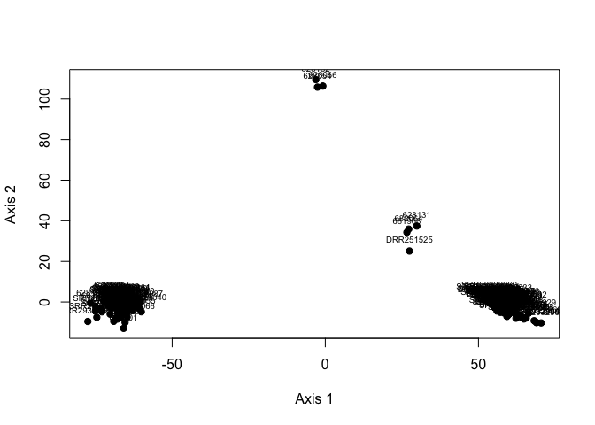<!-- -->

``` r
var_explained <- pcoa_all$eig / sum(pcoa_all$eig) * 100

pc1_lab <- sprintf("Axis 1 (%.1f%%)", var_explained[1])
pc2_lab <- sprintf("Axis 2 (%.1f%%)", var_explained[2])
```

And here’s how I calculated the statistics for the full genomes, plus
control region only, and everything except for control region.

``` r
# Haplotype diversity
hap.div(all_mt)
```

    ## [1] 0.9990581

``` r
# Nucleotide diversity
nuc.div(all_mt)
```

    ## [1] 0.004455232

``` r
nrow(all_mt)
```

    ## [1] 196

``` r
# Number of haplotypes
haps_all_mt <- haplotype(all_mt)
nrow(haps_all_mt)
```

    ## [1] 185

``` r
#Tajima's D
tajima.test(all_mt)
```

    ## $D
    ## [1] -0.9415862
    ## 
    ## $Pval.normal
    ## [1] 0.3464045
    ## 
    ## $Pval.beta
    ## [1] 0.361933

``` r
all_mt_control_only <- read.dna("02_Mitogenomes_local/All_incl_ERR_DRR_control_only.fasta", format = "fasta")

# Haplotype diversity
hap.div(all_mt_control_only)
```

    ## [1] 0.9987441

``` r
# Nucleotide diversity
nuc.div(all_mt_control_only)
```

    ## [1] 0.0156473

``` r
# Number of haplotypes
haps_all_mt_control_only <- haplotype(all_mt_control_only)
nrow(haps_all_mt_control_only)
```

    ## [1] 183

``` r
#Tajima's D
tajima.test(all_mt_control_only)
```

    ## $D
    ## [1] -1.53167
    ## 
    ## $Pval.normal
    ## [1] 0.125604
    ## 
    ## $Pval.beta
    ## [1] 0.102118

``` r
all_mt_no_control<- read.dna("02_Mitogenomes_local/All_incl_ERR_DRR_no_control.fasta", format = "fasta")

# Haplotype diversity
hap.div(all_mt_no_control)
```

    ## [1] 0.981528

``` r
# Nucleotide diversity
nuc.div(all_mt_no_control)
```

    ## [1] 0.003505031

``` r
# Number of haplotypes
haps_all_mt_no_control <- haplotype(all_mt_no_control)
nrow(haps_all_mt_no_control)
```

    ## [1] 106

``` r
#Tajima's D
tajima.test(all_mt_no_control)
```

    ## $D
    ## [1] -0.4914
    ## 
    ## $Pval.normal
    ## [1] 0.6231436
    ## 
    ## $Pval.beta
    ## [1] 0.6682558

Australia only:

``` r
mt_ids <- rownames(all_mt)
mt_meta <- dugong_meta %>%
  filter(bioplatforms_library_id %in% mt_ids)

new_row <- mt_meta[1, ]
new_row[,] <- NA

new_row$bioplatforms_library_id <- "DugDug_mtGenome"
new_row$country <- "Australia"

mt_meta <- bind_rows(mt_meta, new_row)

all_mt_aus <- all_mt[
  rownames(all_mt) %in%
    mt_meta$bioplatforms_library_id[mt_meta$country == "Australia"],
]

# Sample size
nrow(all_mt_aus)
```

    ## [1] 181

``` r
# Haplotype diversity
hap.div(all_mt_aus)
```

    ## [1] 0.998895

``` r
# Nucleotide diversity
nuc.div(all_mt_aus)
```

    ## [1] 0.004280321

``` r
# Number of haplotypes
haps_aus <- haplotype(all_mt_aus)
nrow(haps_aus)
```

    ## [1] 170

``` r
# Tajima's D
tajima.test(all_mt_aus)
```

    ## $D
    ## [1] -0.683747
    ## 
    ## $Pval.normal
    ## [1] 0.494135
    ## 
    ## $Pval.beta
    ## [1] 0.5288262

I then split my data into widespread and restricted group within
Australia (excluding New Caledonian samples!).

``` r
widespread_group <- read.dna("02_Mitogenomes_local/65_samples_widespread.fasta", format = "fasta")

widespread_group <- widespread_group[
  rownames(widespread_group) != "DugDug_mtGenome",
]

# Check sample size
nrow(widespread_group)
```

    ## [1] 65

``` r
# Haplotype diversity
hap.div(widespread_group)
```

    ## [1] 0.9995192

``` r
# Nucleotide diversity
nuc.div(widespread_group)
```

    ## [1] 0.00122584

``` r
# Number of haplotypes
haps_widespread_group <- haplotype(widespread_group)
nrow(haps_widespread_group)
```

    ## [1] 64

``` r
#Tajima's D
tajima.test(widespread_group)
```

    ## $D
    ## [1] -2.258363
    ## 
    ## $Pval.normal
    ## [1] 0.02392301
    ## 
    ## $Pval.beta
    ## [1] 0.006198035

``` r
restricted_group <- read.dna("02_Mitogenomes_local/86_samples_restricted.fasta", format = "fasta")

# Haplotype diversity
hap.div(restricted_group)
```

    ## [1] 0.9975942

``` r
# Nucleotide diversity
nuc.div(restricted_group)
```

    ## [1] 0.001057867

``` r
# Number of haplotypes
haps_restricted_group <- haplotype(restricted_group)
nrow(haps_restricted_group)
```

    ## [1] 81

``` r
#Tajima's D
tajima.test(restricted_group)
```

    ## $D
    ## [1] -2.054743
    ## 
    ## $Pval.normal
    ## [1] 0.03990383
    ## 
    ## $Pval.beta
    ## [1] 0.01723072

And then just to check, ran a PCOA on the separate groups.

``` r
dist_wide <- dist.dna(
  widespread_group,
  model = "TN93",   #based on iqtree
  pairwise.deletion = TRUE
)

pcoa_wide <- pcoa(dist_wide)

pcoa_df <- data.frame(
  Sample = rownames(pcoa_wide$vectors),
  PC1 = pcoa_wide$vectors[,1],
  PC2 = pcoa_wide$vectors[,2]
)

pcoa_df_wide <- data.frame(
  bioplatforms_library_id = rownames(pcoa_wide$vectors),
  PC1 = pcoa_wide$vectors[, 1],
  PC2 = pcoa_wide$vectors[, 2],
  stringsAsFactors = FALSE
)

pcoa_df_wide <- pcoa_df_wide %>%
  left_join(
    dugong_meta %>%
      select(bioplatforms_library_id, location_text, country),
    by = "bioplatforms_library_id"
  )

pcoa_df_wide <- pcoa_df_wide %>%
  mutate(
    location_text = ifelse(
      bioplatforms_library_id == "DugDug_mtGenome",
      "Moreton Bay",
      location_text
    ),
    country = ifelse(
      bioplatforms_library_id == "DugDug_mtGenome",
      "Australia",
      country
    )
  )

ggplot(pcoa_df_wide, aes(PC1, PC2, colour = location_text)) +
  geom_point(size = 2, alpha = 0.9) +
  scale_colour_manual(values = all_location_cols, drop = FALSE) +
  theme_classic() +
  labs(
    x = paste0(
      "PCoA 1 (",
      round(pcoa_wide$values$Relative_eig[1] * 100, 1),
      "%)"
    ),
    y = paste0(
      "PCoA 2 (",
      round(pcoa_wide$values$Relative_eig[2] * 100, 1),
      "%)"
    ),
    colour = "Location"
  )
```

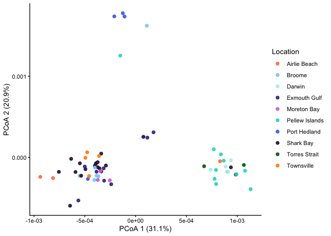<!-- -->

``` r
dist_restr <- dist.dna(
  restricted_group,
  model = "F84",   #based on iqtree it's HKY, but this seems the closest of the available models
  pairwise.deletion = TRUE
)

pcoa_restr <- pcoa(dist_restr)

pcoa_df_restr <- data.frame(
  Sample = rownames(pcoa_restr$vectors),
  PC1 = pcoa_restr$vectors[,1],
  PC2 = pcoa_restr$vectors[,2]
)


pcoa_df_restr <- data.frame(
  bioplatforms_library_id = rownames(pcoa_restr$vectors),
  PC1 = pcoa_restr$vectors[, 1],
  PC2 = pcoa_restr$vectors[, 2],
  PC3 = pcoa_restr$vectors[, 3],
  stringsAsFactors = FALSE
)

pcoa_df_restr <- pcoa_df_restr %>%
  left_join(
    dugong_meta %>%
      select(bioplatforms_library_id, location_text, country),
    by = "bioplatforms_library_id"
  )

pcoa_df_restr <- pcoa_df_restr %>%
  mutate(
    location_text = ifelse(
      bioplatforms_library_id == "DugDug_mtGenome",
      "Moreton Bay",
      location_text
    ),
    country = ifelse(
      bioplatforms_library_id == "DugDug_mtGenome",
      "Australia",
      country
    )
  )

ggplot(pcoa_df_restr, aes(PC1, PC2, colour = location_text)) +
  geom_point(size = 2, alpha = 0.9) +
  scale_colour_manual(values = all_location_cols, drop = FALSE) +
  theme_classic() +
  labs(
    x = paste0(
      "PCoA 1 (",
      round(pcoa_restr$values$Relative_eig[1] * 100, 1),
      "%)"
    ),
    y = paste0(
      "PCoA 2 (",
      round(pcoa_restr$values$Relative_eig[2] * 100, 1),
      "%)"
    ),
    colour = "Location"
  )
```

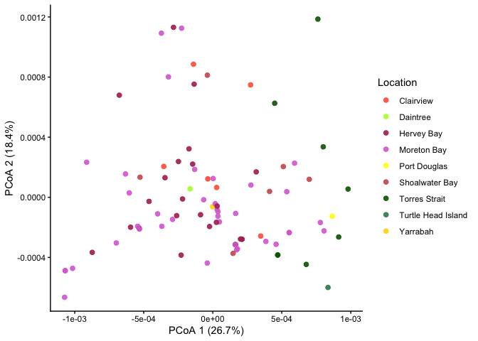<!-- -->

``` r
ggplot(pcoa_df_restr, aes(PC2, PC3, colour = location_text)) +
  geom_point(size = 2, alpha = 0.9) +
  scale_colour_manual(values = all_location_cols, drop = FALSE) +
  theme_classic() +
  labs(
    x = paste0(
      "PCoA 2 (",
      round(pcoa_restr$values$Relative_eig[2] * 100, 1),
      "%)"
    ),
    y = paste0(
      "PCoA 3 (",
      round(pcoa_restr$values$Relative_eig[3] * 100, 1),
      "%)"
    ),
    colour = "Location"
  )
```

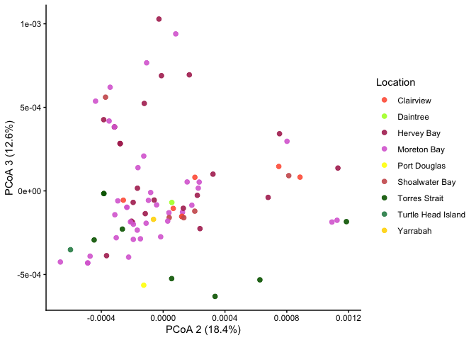<!-- -->

``` r
pcoa_df_all <- data.frame(
  bioplatforms_library_id = rownames(pcoa_all$points),
  PC1 = pcoa_all$points[, 1],
  PC2 = pcoa_all$points[, 2],
  stringsAsFactors = FALSE
) %>%
  left_join(
    dugong_meta %>%
      select(bioplatforms_library_id, location_text, country),
    by = "bioplatforms_library_id"
  ) %>%
  mutate(
    # Fix reference sample
    location_text = ifelse(
      bioplatforms_library_id == "DugDug_mtGenome",
      "Moreton Bay",
      location_text
    ),
    country = ifelse(
      bioplatforms_library_id == "DugDug_mtGenome",
      "Australia",
      country
    ),

    # FINAL plotting variable 
    plot_location = case_when(
      country == "Australia" ~ location_text,
      country == "UAE" ~ "UAE",
      country == "Palau" ~ "Palau",
      country == "Malaysia" ~ "Malaysia",
      country == "Japan" ~ "Japan",
      country == "New Caledonia" ~ "New Caledonia",
      TRUE ~ NA_character_
    )
  )

pcoa_df_all$plot_location <- factor(
  pcoa_df_all$plot_location,
  levels = names(all_location_cols)
)

non_aus <- c("UAE","Palau","Malaysia","Japan","New Caledonia")

shape_values <- setNames(
  ifelse(names(all_location_cols) %in% non_aus, 15, 16),
  names(all_location_cols)
)

pcoa_aus <- pcoa_df_all %>%
  filter(country == "Australia")

pcoa_non_aus <- pcoa_df_all %>%
  filter(country != "Australia")

final_plot <- ggplot() +
  ## Australian samples: circles
  geom_point(
    data = pcoa_aus,
    aes(PC1, PC2, colour = plot_location),
    size = 3,
    shape = 16
  ) +
  ## Non-Australian samples: squares
  geom_point(
    data = pcoa_non_aus,
    aes(PC1, PC2, colour = plot_location),
    size = 3,
    shape = 15
  ) +
  scale_colour_manual(values = all_location_cols, drop = FALSE) +
  theme_classic() +
  labs(
    x = pc1_lab,
    y = pc2_lab,
    colour = "Location"
  )

final_plot
```

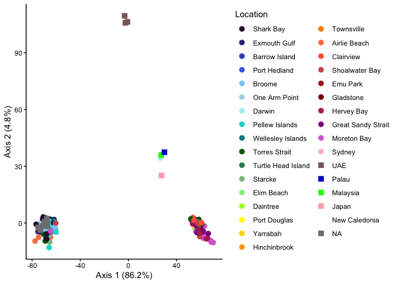<!-- -->

``` r
d <- dist.dna(all_mt, model = "N", pairwise.deletion = TRUE)

pcoa_full <- cmdscale(d, k = 2, eig = TRUE)

pcoa_df_full <- data.frame(
  bioplatforms_library_id = rownames(pcoa_full$points),
  PC1 = pcoa_full$points[, 1],
  PC2 = pcoa_full$points[, 2],
  stringsAsFactors = FALSE
)

#ggsave(
#  filename = "pcoa_plot.png",
#  plot = final_plot,
#  width = 250,
#  height = 160,
#  units = "mm",
#  dpi = 600
#)
```

Then I made a traits file for popart for the whole mitochondrial genome,
the mitochondrial genome with just the control region, and the
mitochondrial genome without the control region.

``` r
whole_mt <- read.nexus.data("02_Mitogenomes_local/All_incl_ERR_DRR.nex")

sample_names <- names(whole_mt)

traits_for_popart_full <- data.frame(
  ID = sample_names
) %>%
  left_join(
    dugong_meta %>%
      select(
        bioplatforms_library_id,
        location_text
      ),
    by = c("ID" = "bioplatforms_library_id")
  ) %>%
  rename(
    Region = location_text
  ) %>%
  mutate(
    Region = ifelse(
      ID == "DugDug_mtGenome",
      "Moreton Bay",
      Region
    )
  )

traits_for_popart_full %>%
  filter(is.na(Region))
```

    ## [1] ID     Region
    ## <0 rows> (or 0-length row.names)

``` r
traits_for_popart_full <- traits_for_popart_full %>%
  mutate(
    Region = gsub(" ", "_", Region)
  )

trait_matrix <- traits_for_popart_full %>%
  mutate(value = 1) %>%
  pivot_wider(
    names_from = Region,
    values_from = value,
    values_fill = 0
  )


locations <- colnames(trait_matrix)[-1]

out_file <- "traits_block.txt"

con <- file(out_file, open = "w")

cat("BEGIN TRAITS;\n", file = con)

cat(
  "Dimensions NTRAITS=",
  length(locations),
  ";\n",
  sep = "",
  file = con
)

cat(
  "Format labels=yes missing=? separator=Comma;\n",
  file = con
)

cat(
  "TraitLabels ",
  paste(locations, collapse = " "),
  ";\n",
  sep = "",
  file = con
)

cat("Matrix\n", file = con)

apply(trait_matrix, 1, function(row) {

  cat(
    row[1],
    " ",
    paste(row[-1], collapse = ","),
    "\n",
    sep = "",
    file = con
  )

})
```

    ## NULL

``` r
cat(";\nEND;\n", file = con)

close(con)
```

And now link those results back to the metadata.

``` r
popart_edges <- read_tsv(
  "02_Mitogenomes_local/All_incl_ERR_DRR_traits.txt",
  col_names = c("from", "steps", "to")
)
```

    ## Rows: 338 Columns: 3
    ## ── Column specification ────────────────────────────────────────────────────────
    ## Delimiter: "\t"
    ## chr (2): from, to
    ## dbl (1): steps
    ## 
    ## ℹ Use `spec()` to retrieve the full column specification for this data.
    ## ℹ Specify the column types or set `show_col_types = FALSE` to quiet this message.

``` r
meta_lookup <- dugong_meta %>%
  select(
    bioplatforms_library_id,
    location_text
  ) %>%
  distinct()

annotated_edges <- popart_edges %>%

  left_join(
    meta_lookup,
    by = c("from" = "bioplatforms_library_id")
  ) %>%
  rename(
    from_location = location_text
  ) %>%

  left_join(
    meta_lookup,
    by = c("to" = "bioplatforms_library_id")
  ) %>%
  rename(
    to_location = location_text
  )

annotated_edges
```

    ## # A tibble: 338 × 5
    ##    from        steps to          from_location to_location  
    ##    <chr>       <dbl> <chr>       <chr>         <chr>        
    ##  1 SRR29329050     1 SRR29328990 Moreton Bay   Hervey Bay   
    ##  2 628133          1 SRR29328990 Gladstone     Hervey Bay   
    ##  3 SRR29329060     1 SRR29329054 Clairview     Moreton Bay  
    ##  4 628114          1 628103      Exmouth Gulf  Exmouth Gulf 
    ##  5 628138          1 SRR29329040 Yarrabah      Clairview    
    ##  6 628086          1 SRR29328998 Townsville    Townsville   
    ##  7 628061          1 681989      Broome        Shark Bay    
    ##  8 628095          1 628062      Shark Bay     Shark Bay    
    ##  9 SRR29329045     1 SRR29328968 Moreton Bay   Moreton Bay  
    ## 10 181             1 682043      <NA>          New Caledonia
    ## # ℹ 328 more rows

``` r
sample_summary <- bind_rows(

  annotated_edges %>%
    select(ID = from, Location = from_location),

  annotated_edges %>%
    select(ID = to, Location = to_location)

) %>%
  filter(!is.na(Location)) %>%
  distinct()

sample_summary
```

    ## # A tibble: 180 × 2
    ##    ID          Location    
    ##    <chr>       <chr>       
    ##  1 SRR29329050 Moreton Bay 
    ##  2 628133      Gladstone   
    ##  3 SRR29329060 Clairview   
    ##  4 628114      Exmouth Gulf
    ##  5 628138      Yarrabah    
    ##  6 628086      Townsville  
    ##  7 628061      Broome      
    ##  8 628095      Shark Bay   
    ##  9 SRR29329045 Moreton Bay 
    ## 10 SRR29329041 Moreton Bay 
    ## # ℹ 170 more rows

Now for the mitochondrial genome without the control region.

``` r
no_contr <- read.nexus.data("02_Mitogenomes_local/All_incl_ERR_DRR_no_control.nex")

sample_names <- names(no_contr)

traits_for_popart_full <- data.frame(
  ID = sample_names
) %>%
  left_join(
    dugong_meta %>%
      select(
        bioplatforms_library_id,
        location_text
      ),
    by = c("ID" = "bioplatforms_library_id")
  ) %>%
  rename(
    Region = location_text
  ) %>%
  mutate(
    Region = ifelse(
      ID == "DugDug_mtGenome",
      "Moreton Bay",
      Region
    )
  )

traits_for_popart_full %>%
  filter(is.na(Region))
```

    ## [1] ID     Region
    ## <0 rows> (or 0-length row.names)

``` r
traits_for_popart_full <- traits_for_popart_full %>%
  mutate(
    Region = gsub(" ", "_", Region)
  )

trait_matrix <- traits_for_popart_full %>%
  mutate(value = 1) %>%
  pivot_wider(
    names_from = Region,
    values_from = value,
    values_fill = 0
  )


locations <- colnames(trait_matrix)[-1]

out_file <- "traits_block_no_control.txt"

con <- file(out_file, open = "w")

cat("BEGIN TRAITS;\n", file = con)

cat(
  "Dimensions NTRAITS=",
  length(locations),
  ";\n",
  sep = "",
  file = con
)

cat(
  "Format labels=yes missing=? separator=Comma;\n",
  file = con
)

cat(
  "TraitLabels ",
  paste(locations, collapse = " "),
  ";\n",
  sep = "",
  file = con
)

cat("Matrix\n", file = con)

apply(trait_matrix, 1, function(row) {

  cat(
    row[1],
    " ",
    paste(row[-1], collapse = ","),
    "\n",
    sep = "",
    file = con
  )

})
```

    ## NULL

``` r
cat(";\nEND;\n", file = con)

close(con)
```

Now the same thing just with the control region only.

``` r
control_region <- read.dna(
  "02_Mitogenomes_local/All_incl_ERR_DRR_control_only.fasta",
  format = "fasta"
)

sample_names <- rownames(control_region)

traits_for_popart_control <- data.frame(
  ID = sample_names
) %>%
  left_join(
    dugong_meta %>%
      select(
        bioplatforms_library_id,
        location_text
      ),
    by = c("ID" = "bioplatforms_library_id")
  ) %>%
  rename(
    Region = location_text
  ) %>%
  mutate(
    Region = ifelse(
      ID == "DugDug_mtGenome",
      "Moreton Bay",
      Region
    )
  )


traits_for_popart_control %>%
  filter(is.na(Region))
```

    ## [1] ID     Region
    ## <0 rows> (or 0-length row.names)

``` r
traits_for_popart_control <- traits_for_popart_control %>%
  mutate(
    Region = gsub(" ", "_", Region)
  )


trait_matrix <- traits_for_popart_control %>%
  mutate(value = 1) %>%
  pivot_wider(
    names_from = Region,
    values_from = value,
    values_fill = 0
  )

locations <- colnames(trait_matrix)[-1]

out_file <- "02_Mitogenomes_local/traits_block_control_only.txt"

con <- file(out_file, open = "w")

cat("BEGIN TRAITS;\n", file = con)

cat(
  "Dimensions NTRAITS=",
  length(locations),
  ";\n",
  sep = "",
  file = con
)

cat(
  "Format labels=yes missing=? separator=Comma;\n",
  file = con
)

cat(
  "TraitLabels ",
  paste(locations, collapse = " "),
  ";\n",
  sep = "",
  file = con
)

cat("Matrix\n", file = con)

apply(trait_matrix, 1, function(row) {

  cat(
    row[1],
    " ",
    paste(row[-1], collapse = ","),
    "\n",
    sep = "",
    file = con
  )

})
```

    ## NULL

``` r
cat(";\nEND;\n", file = con)

close(con)
```

Now I’m looking at where the differences are along the mitochondrial
genome exactly.

``` r
mt_DNA <- read.dna("02_Mitogenomes_local/All_incl_ERR_DRR.fasta",
                format = "fasta")

bed <- read.table("02_Mitogenomes_local/Dugong_mito_genome.bed",
                  header = FALSE,
                  stringsAsFactors = FALSE)

colnames(bed) <- c("chrom",
                   "start",
                   "end",
                   "gene",
                   "score",
                   "strand")
```

``` r
seg_sites <- seg.sites(mt_DNA)

length(seg_sites)
```

    ## [1] 651

``` r
head(seg_sites)
```

    ## [1]  17 158 162 207 225 250

``` r
snp_df <- data.frame(position = seg_sites)

snp_df$gene <- NA

for(i in 1:nrow(bed)) {

  idx <- snp_df$position >= bed$start[i] &
         snp_df$position <= bed$end[i]

  snp_df$gene[idx] <- bed$gene[i]
}

head(snp_df)
```

    ##   position  gene
    ## 1       17 trnaF
    ## 2      158  rrnS
    ## 3      162  rrnS
    ## 4      207  rrnS
    ## 5      225  rrnS
    ## 6      250  rrnS

``` r
gene_counts <- snp_df %>%
  group_by(gene) %>%
  summarise(n_snps = n()) %>%
  arrange(desc(n_snps))
```

``` r
window_size <- 200
step_size <- 50

genome_length <- ncol(mt_DNA)

windows <- seq(1,
               genome_length - window_size,
               by = step_size)

snp_counts <- sapply(windows, function(w) {

  sum(seg_sites >= w &
      seg_sites < (w + window_size))
})

plot_df <- data.frame(
  position = windows,
  snps = snp_counts
)

ggplot(plot_df,
       aes(position, snps)) +

  geom_line() +

  theme_bw() +

  labs(x = "Mitogenome position",
       y = "SNPs per 200 bp window")
```

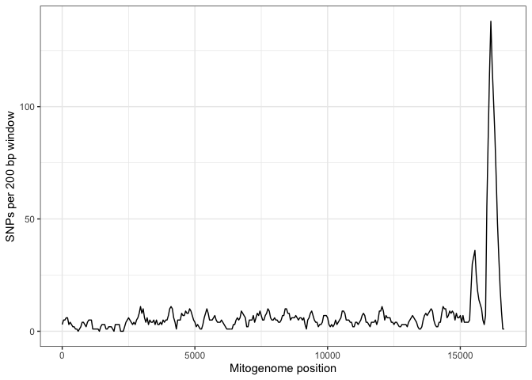<!-- -->

``` r
samples_widespread <- pcoa_df_full %>%
  filter(PC1 < -40)
samples_restricted <- pcoa_df_full %>%
  filter(PC1 > 40)

restricted_ids <- samples_restricted$bioplatforms_library_id
widespread_ids <- samples_widespread$bioplatforms_library_id

rownames(mt_DNA)[1:10]
```

    ##  [1] "DugDug_mtGenome" "682056"          "SRR29328990"     "SRR29328970"    
    ##  [5] "628101"          "SRR29329043"     "SRR29329041"     "SRR29329065"    
    ##  [9] "628122"          "628073"

``` r
sum(restricted_ids %in% rownames(mt_DNA))
```

    ## [1] 100

``` r
sum(widespread_ids %in% rownames(mt_DNA))
```

    ## [1] 89

``` r
dna_matrix <- as.character(mt_DNA)

restricted_ids <- restricted_ids[
  restricted_ids %in% rownames(dna_matrix)
]

widespread_ids <- widespread_ids[
  widespread_ids %in% rownames(dna_matrix)
]
```

``` r
fixed_sites <- c()

for(pos in 1:ncol(dna_matrix)) {

  restricted_bases <- unique(
    dna_matrix[restricted_ids, pos]
  )

  widespread_bases <- unique(
    dna_matrix[widespread_ids, pos]
  )

  restricted_bases <- setdiff(
    restricted_bases,
    c("-", "n", "N", "?")
  )

  widespread_bases <- setdiff(
    widespread_bases,
    c("-", "n", "N", "?")
  )

  if(length(restricted_bases) == 1 &
     length(widespread_bases) == 1 &
     restricted_bases[1] != widespread_bases[1]) {

    fixed_sites <- c(fixed_sites, pos)
  }
}

length(fixed_sites)
```

    ## [1] 87

``` r
head(fixed_sites)
```

    ## [1]  158  207  381  934  937 1146

``` r
control_region <- data.frame(
  chrom = "Dugong_mito_genome",
  start = 15432,
  end = ncol(dna_matrix),
  gene = "control_region",
  score = 1,
  strand = "+"
)

bed2 <- rbind(bed, control_region)

fixed_df <- data.frame(
  position = fixed_sites
)

fixed_df$gene <- NA

for(i in 1:nrow(bed2)) {

  idx <- fixed_df$position >= bed2$start[i] &
         fixed_df$position <= bed2$end[i]

  fixed_df$gene[idx] <- bed2$gene[i]
}

fixed_summary <- fixed_df %>%
  group_by(gene) %>%
  summarise(n_fixed = n()) %>%
  arrange(desc(n_fixed))

fixed_summary
```

    ## # A tibble: 20 × 2
    ##    gene           n_fixed
    ##    <chr>            <int>
    ##  1 nad5                17
    ##  2 control_region       9
    ##  3 nad2                 9
    ##  4 nad4                 9
    ##  5 cox1                 6
    ##  6 atp6                 5
    ##  7 nad1                 5
    ##  8 nad6                 5
    ##  9 rrnS                 5
    ## 10 cox2                 3
    ## 11 cob                  2
    ## 12 cox3                 2
    ## 13 nad3                 2
    ## 14 rrnL                 2
    ## 15 atp8                 1
    ## 16 nad4l                1
    ## 17 trnaA                1
    ## 18 trnaL2               1
    ## 19 trnaS2               1
    ## 20 trnaW                1

``` r
window_size <- 100
step_size <- 10

windows <- seq(
  1,
  ncol(dna_matrix) - window_size,
  by = step_size
)

fixed_counts <- sapply(windows, function(w) {

  sum(fixed_sites >= w &
      fixed_sites < (w + window_size))
})

mini_windows <- data.frame(
  start = windows,
  end = windows + window_size,
  fixed_diffs = fixed_counts
)

mini_windows %>%
  arrange(desc(fixed_diffs)) %>%
  head(20)
```

    ##    start   end fixed_diffs
    ## 1  15511 15611           5
    ## 2  15521 15621           5
    ## 3  15531 15631           5
    ## 4  15541 15641           5
    ## 5  15551 15651           5
    ## 6  15561 15661           5
    ## 7  15571 15671           5
    ## 8  15581 15681           5
    ## 9  12041 12141           4
    ## 10 12051 12151           4
    ## 11 12061 12161           4
    ## 12 12071 12171           4
    ## 13 15501 15601           4
    ## 14 15591 15691           4
    ## 15  5481  5581           3
    ## 16  5491  5591           3
    ## 17  5501  5601           3
    ## 18 11801 11901           3
    ## 19 12011 12111           3
    ## 20 12021 12121           3

So most of these are in the control region, but some are in the NAD
region, which is a coding region!

``` r
candidate_start <- 12040
candidate_end <- 12170

restricted_consensus <- apply(
  dna_matrix[restricted_ids,
             candidate_start:candidate_end],
  2,
  function(x) {
    names(sort(table(x),
               decreasing = TRUE))[1]
  }
)

widespread_consensus <- apply(
  dna_matrix[widespread_ids,
             candidate_start:candidate_end],
  2,
  function(x) {
    names(sort(table(x),
               decreasing = TRUE))[1]
  }
)

diagnostic_snps <- data.frame(
  position = candidate_start:candidate_end,
  restricted = restricted_consensus,
  widespread = widespread_consensus
)

diagnostic_snps <- diagnostic_snps %>%
  filter(restricted != widespread)

diagnostic_snps
```

    ##   position restricted widespread
    ## 1    12073          g          a
    ## 2    12089          t          c
    ## 3    12108          t          c
    ## 4    12140          g          a

``` r
window_size <- 200
step_size <- 50

windows <- seq(
  1,
  ncol(dna_matrix) - window_size,
  by = step_size
)

fixed_counts <- sapply(windows, function(w) {

  sum(fixed_sites >= w &
      fixed_sites < (w + window_size))
})

fixed_plot <- data.frame(
  position = windows,
  fixed_diffs = fixed_counts
)

ggplot(fixed_plot,
       aes(position, fixed_diffs)) +

  geom_line(linewidth = 1) +

  theme_bw() +

  labs(
    x = "Mitogenome position",
    y = "Fixed differences"
  )
```

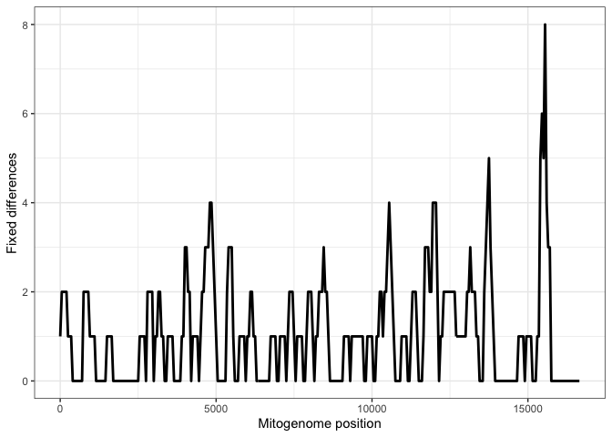<!-- -->

``` r
mean(fixed_df$gene == "control_region")
```

    ## [1] 0.1034483

Now I want to see whether there is a similar story with the other
groups, not just widespread vs restricted within Australia.

``` r
uae_ids <- c(
  "628132",
  "628054",
  "628066"
)

other_ids <- c(
  "DRR251525",
  "682064",
  "628131",
  "681968"
)

coding_positions <- 1:15431

dna_matrix <- as.character(mt_DNA)[, coding_positions]

group_list <- list(
  widespread = widespread_ids,
  restricted = restricted_ids,
  uae = uae_ids,
  other = other_ids
)

diagnostic_sites <- list()

for(pos in 1:ncol(dna_matrix)) {

  group_consensus <- c()

  valid_site <- TRUE

  for(g in names(group_list)) {

    ids <- group_list[[g]]

    ids <- ids[ids %in% rownames(dna_matrix)]

    bases <- unique(
      dna_matrix[ids, pos]
    )

    bases <- setdiff(
      bases,
      c("-", "N", "n", "?")
    )

    if(length(bases) != 1) {

      valid_site <- FALSE
      break
    }

    group_consensus[g] <- bases
  }

  if(valid_site &&
     length(unique(group_consensus)) > 1) {

    diagnostic_sites[[length(diagnostic_sites)+1]] <-
      data.frame(
        position = pos,
        widespread = group_consensus["widespread"],
        restricted = group_consensus["restricted"],
        uae = group_consensus["uae"],
        other = group_consensus["other"]
      )
  }
}

diagnostic_df <- do.call(rbind,
                         diagnostic_sites)
```

``` r
diagnostic_df$gene <- NA

for(i in 1:nrow(bed)) {

  idx <- diagnostic_df$position >= bed$start[i] &
         diagnostic_df$position <= bed$end[i]

  diagnostic_df$gene[idx] <- bed$gene[i]
}

diagnostic_summary <- diagnostic_df %>%
  group_by(gene) %>%
  summarise(n_diag = n()) %>%
  arrange(desc(n_diag))

diagnostic_summary
```

    ## # A tibble: 21 × 2
    ##    gene  n_diag
    ##    <chr>  <int>
    ##  1 nad5      25
    ##  2 nad4      16
    ##  3 nad2      12
    ##  4 cob       10
    ##  5 nad1      10
    ##  6 cox1       8
    ##  7 nad6       8
    ##  8 cox3       6
    ##  9 atp6       5
    ## 10 cox2       5
    ## # ℹ 11 more rows

``` r
group_list <- lapply(group_list, function(ids) {

  intersect(ids,
            rownames(dna_matrix))
})

sapply(group_list, length)
```

    ## widespread restricted        uae      other 
    ##         89        100          3          4

``` r
private_sites <- list()


for(target_group in names(group_list)) {

  target_ids <- group_list[[target_group]]

  # Skip empty groups
  if(length(target_ids) == 0) {
    next
  }

  private_positions <- c()

  for(pos in 1:ncol(dna_matrix)) {

    # TARGET BASES
    target_bases <- unique(
      dna_matrix[target_ids, pos, drop = TRUE]
    )

    target_bases <- setdiff(
      target_bases,
      c("-", "N", "n", "?")
    )

    # Must be fixed within lineage
    if(length(target_bases) != 1) {
      next
    }

    target_base <- target_bases[1]

    # OTHER IDS
    other_ids <- unlist(
      group_list[
        names(group_list) != target_group
      ]
    )

    other_ids <- intersect(
      other_ids,
      rownames(dna_matrix)
    )

    # Skip if no comparison samples
    if(length(other_ids) == 0) {
      next
    }

    other_bases <- unique(
      dna_matrix[other_ids, pos, drop = TRUE]
    )

    other_bases <- setdiff(
      other_bases,
      c("-", "N", "n", "?")
    )

    # PRIVATE SNPs
    if(!(target_base %in% other_bases)) {

      private_positions <- c(
        private_positions,
        pos
      )
    }
  }

  private_sites[[target_group]] <- private_positions
}

private_summary <- data.frame(
  lineage = names(private_sites),
  private_diagnostic_snps =
    sapply(private_sites, length)
)

private_summary
```

    ##               lineage private_diagnostic_snps
    ## widespread widespread                      37
    ## restricted restricted                      24
    ## uae               uae                      45
    ## other           other                       9

``` r
private_df <- data.frame(
  lineage = rep(
    names(private_sites),
    sapply(private_sites, length)
  ),
  position = unlist(private_sites)
)

uae_df <- private_df %>%
  filter(lineage == "uae")

ggplot(uae_df,
       aes(position)) +

  geom_histogram(binwidth = 200) +

  theme_bw() +

  labs(
    x = "Mitogenome position",
    y = "Private UAE SNPs"
  )
```

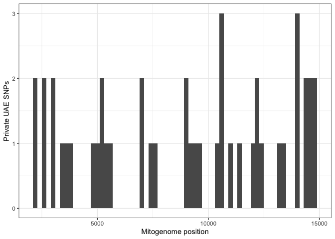<!-- -->

``` r
diag_positions <- diagnostic_df$position

window_size <- 100
step_size <- 10

windows <- seq(
  1,
  ncol(dna_matrix) - window_size,
  by = step_size
)

diag_counts <- sapply(windows, function(w) {

  sum(diag_positions >= w &
      diag_positions < (w + window_size))
})

mini_windows <- data.frame(
  start = windows,
  end = windows + window_size,
  diagnostic_snps = diag_counts
)

mini_windows %>%
  arrange(desc(diagnostic_snps)) %>%
  head(20)
```

    ##    start   end diagnostic_snps
    ## 1   4841  4941               5
    ## 2   4851  4951               5
    ## 3   4861  4961               5
    ## 4  10601 10701               5
    ## 5  10611 10711               5
    ## 6  10641 10741               5
    ## 7  10651 10751               5
    ## 8  12041 12141               5
    ## 9  12051 12151               5
    ## 10 12071 12171               5
    ## 11  2971  3071               4
    ## 12  4811  4911               4
    ## 13  4821  4921               4
    ## 14  4831  4931               4
    ## 15  4871  4971               4
    ## 16  4881  4981               4
    ## 17  4891  4991               4
    ## 18  4901  5001               4
    ## 19 10561 10661               4
    ## 20 10571 10671               4

``` r
inspect_region <- function(start_pos,
                           end_pos,
                           dna_matrix,
                           group_list) {

  get_consensus <- function(ids) {

    apply(
      dna_matrix[ids,
                 start_pos:end_pos,
                 drop = FALSE],
      2,
      function(x) {

        x <- x[!x %in%
                 c("-", "N", "n", "?")]

        if(length(x) == 0) {
          return(NA)
        }

        names(sort(table(x),
                   decreasing = TRUE))[1]
      }
    )
  }

  consensus_df <- data.frame(
    position = start_pos:end_pos
  )

  for(g in names(group_list)) {

    ids <- intersect(
      group_list[[g]],
      rownames(dna_matrix)
    )

    consensus_df[[g]] <- get_consensus(ids)
  }

  consensus_df %>%

    rowwise() %>%

    mutate(
      n_unique = length(
        unique(
          na.omit(
            c_across(-position)
          )
        )
      )
    ) %>%

    ungroup() %>%

    filter(n_unique > 1)
}
```

``` r
nd5_region <- inspect_region(
  start_pos = 12041,
  end_pos = 12171,
  dna_matrix = dna_matrix,
  group_list = group_list
)

nd5_region
```

    ## # A tibble: 6 × 6
    ##   position widespread restricted uae   other n_unique
    ##      <int> <chr>      <chr>      <chr> <chr>    <int>
    ## 1    12059 a          a          g     a            2
    ## 2    12073 a          g          g     g            2
    ## 3    12089 c          t          t     t            2
    ## 4    12108 c          t          t     t            2
    ## 5    12140 a          g          a     g            2
    ## 6    12165 c          c          t     c            2

``` r
nd4_region <- inspect_region(
  start_pos = 10601,
  end_pos = 10751,
  dna_matrix = dna_matrix,
  group_list = group_list
)

nd4_region
```

    ## # A tibble: 7 × 6
    ##   position widespread restricted uae   other n_unique
    ##      <int> <chr>      <chr>      <chr> <chr>    <int>
    ## 1    10618 c          t          c     c            2
    ## 2    10630 g          g          a     g            2
    ## 3    10660 g          g          a     g            2
    ## 4    10690 g          g          a     g            2
    ## 5    10693 g          a          g     g            2
    ## 6    10733 g          g          g     a            2
    ## 7    10738 t          c          t     c            2

Now I will map them!

``` r
map_df <- dugong_meta %>%
  mutate(
    decimal_longitude_private = as.numeric(decimal_longitude_private),
    decimal_latitude_private  = as.numeric(decimal_latitude_private),
    plot_location = case_when(
      country == "Australia" ~ location_text,
      country == "UAE" ~ "UAE",
      country == "Palau" ~ "Palau",
      country == "Malaysia" ~ "Malaysia",
      country == "Japan" ~ "Japan",
      country == "New_Caledonia" ~ "New Caledonia",
      TRUE ~ NA_character_
    ),
    shape_group = ifelse(country == "Australia", "Australia", "Outside Australia")
  ) %>%
  filter(!is.na(plot_location))

world <- map_data("world")

map_df_filtered <- map_df %>%
  dplyr::filter(plot_location != "Arcadia Vale")

outside_aus <- c("UAE", "Palau", "Malaysia", "Japan", "New Caledonia")
legend_shapes <- ifelse(
  all_locations_order %in% outside_aus,
  15,  # square
  16   # circle
)

ggplot() +
  borders("world", colour = "grey70", fill = "grey95") +

  geom_point(
    data = map_df_filtered,
    aes(
      x = decimal_longitude_private,
      y = decimal_latitude_private,
      colour = plot_location,
      shape  = shape_group
    ),
    size = 3
  ) +

  scale_colour_manual(
    values = all_location_cols[all_locations_order], 
    breaks = all_locations_order,
    drop = FALSE
  ) +

  scale_shape_manual(
    values = c("Australia" = 16, "Outside Australia" = 15),
    guide = "none"  
  ) +

  coord_sf(
    xlim = c(45, 180),
    ylim = c(-40, 40),
    expand = FALSE
  ) +

  theme_classic() +
  labs(
    x = "Longitude",
    y = "Latitude",
    colour = "Location"
  )
```

    ## Warning: `borders()` was deprecated in ggplot2 4.0.0.
    ## ℹ Please use `annotation_borders()` instead.
    ## This warning is displayed once per session.
    ## Call `lifecycle::last_lifecycle_warnings()` to see where this warning was
    ## generated.

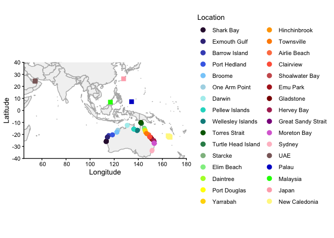<!-- --> And now
a map of widespread vs restricted.

``` r
samples_widespread <- pcoa_df_full %>%
  filter(PC1 < -40) %>%
  mutate(lineage = "Widespread")

samples_restricted <- pcoa_df_full %>%
  filter(PC1 > 40) %>%
  mutate(lineage = "Restricted")

lineage_df <- bind_rows(
  samples_widespread,
  samples_restricted
)
```

``` r
map_lineages <- dugong_meta %>%
  inner_join(
    lineage_df %>%
      select(bioplatforms_library_id, lineage),
    by = "bioplatforms_library_id"
  ) %>%
  mutate(
    decimal_longitude_private =
      as.numeric(decimal_longitude_private),

    decimal_latitude_private =
      as.numeric(decimal_latitude_private)
  ) %>%
  filter(country == "Australia")
```

``` r
ggplot() +

  borders("world",
          colour = "grey70",
          fill = "grey95") +

  geom_point(
  data = map_lineages,
  aes(
    x = decimal_longitude_private,
    y = decimal_latitude_private,
    colour = lineage
  ),
  position = position_jitter(width = 0.3, height = 0.3),
  size = 3
) +

  scale_colour_manual(
    values = c(
      "Restricted" = "#D55E00",
      "Widespread" = "#0072B2"
    )
  ) +

  coord_sf(
    xlim = c(110, 155),
    ylim = c(-40, -8),
    expand = FALSE
  ) +

  theme_classic() +

  labs(
    x = "Longitude",
    y = "Latitude",
    colour = "Mitochondrial lineage"
  )
```

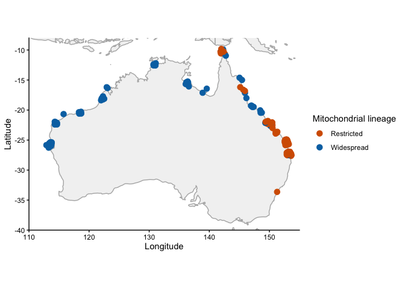<!-- -->

``` r
lineage_summary <- map_lineages %>%
  group_by(location_text, lineage) %>%
  summarise(n = n(), .groups = "drop") %>%
  tidyr::pivot_wider(
    names_from = lineage,
    values_from = n,
    values_fill = 0
  ) %>%
  arrange(location_text)

lineage_summary
```

    ## # A tibble: 27 × 3
    ##    location_text Widespread Restricted
    ##    <chr>              <int>      <int>
    ##  1 Airlie Beach           3          0
    ##  2 Barrow Island          1          0
    ##  3 Broome                 7          0
    ##  4 Clairview              2          6
    ##  5 Daintree               0          1
    ##  6 Darwin                 4          0
    ##  7 Elim Beach             1          0
    ##  8 Emu Park               0          1
    ##  9 Exmouth Gulf          11          0
    ## 10 Gladstone              0          4
    ## # ℹ 17 more rows

Here are the stats for New Caledonia and UAE.

``` r
new_cal <- read.dna("02_Mitogenomes_local/New_Cal_mtDNA_alignment.fasta", format = "fasta")

# Haplotype diversity
hap.div(new_cal)
```

    ## [1] 1

``` r
# Nucleotide diversity
nuc.div(new_cal)
```

    ## [1] 0.0009207556

``` r
# Number of haplotypes
haps_new_cal <- haplotype(new_cal)
nrow(haps_new_cal)
```

    ## [1] 9

``` r
#Tajima's D
tajima.test(new_cal)
```

    ## $D
    ## [1] -1.525038
    ## 
    ## $Pval.normal
    ## [1] 0.1272496
    ## 
    ## $Pval.beta
    ## [1] 0.1102169

``` r
uae <- read.dna("02_Mitogenomes_local/Abu_Dhabi_mtDNA_aligned.fasta", format = "fasta")

# Haplotype diversity
hap.div(uae)
```

    ## [1] 1

``` r
# Nucleotide diversity
nuc.div(uae)
```

    ## [1] 0.0004748056

``` r
# Number of haplotypes
haps_uae <- haplotype(uae)
nrow(haps_uae)
```

    ## [1] 3

``` r
#Tajima's D
tajima.test(uae)
```

    ## Warning in tajima.test(uae): Tajima test requires at least 4 sequences

    ## $D
    ## [1] NaN
    ## 
    ## $Pval.normal
    ## [1] NaN
    ## 
    ## $Pval.beta
    ## [1] NaN

SKYLINE PLOTS!

``` r
skyline <- read_tsv(
  "02_Mitogenomes_local/86_samples_restricted_group_skyline_plot.txt",
  skip = 1,
  col_types = cols()
)

ggplot(skyline, aes(x = time)) +
  geom_ribbon(aes(ymin = lower, ymax = upper),
              fill = "grey80", alpha = 0.6) +
  geom_line(aes(y = mean), linewidth = 1, colour = "black") +
  geom_line(aes(y = median), linewidth = 0.8, linetype = "dashed") +
  scale_x_reverse() +
  theme_bw()
```

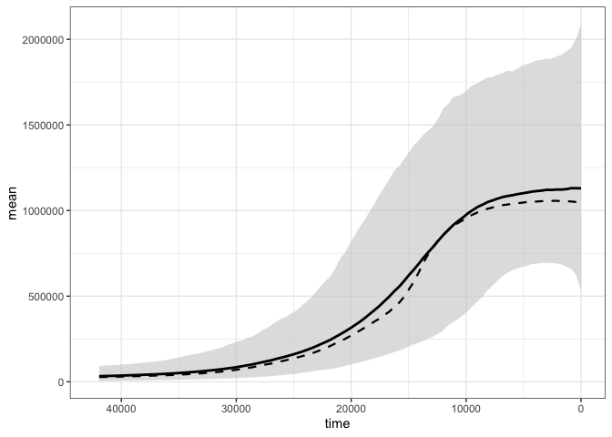<!-- -->

And the sea level data:

``` r
sea_level <- read_tsv(
  "02_Mitogenomes_local/SPRATT2016_SEALEVEL-data.txt",
  comment = "#",
  col_types = cols()
)

sea_level_clean <- sea_level %>%
  mutate(time = age_calkaBP * 1000)

x_limits <- c(41927.65, 0)

p_sea <- ggplot(sea_level_clean, aes(x = time, y = SeaLev_shortPC1)) +
  geom_ribbon(
    aes(
      ymin = SeaLev_shortPC1_err_lo,
      ymax = SeaLev_shortPC1_err_up
    ),
    fill = "steelblue",
    alpha = 0.3
  ) +
  geom_line(linewidth = 1) +
  scale_x_reverse(
    expand = c(0, 0),
    labels = scales::label_number(big.mark = ",")
  ) +
  coord_cartesian(xlim = x_limits) +
  theme_bw() +
  labs(
    x = "Time before present (years)",
    y = "Sea level (m)"
  )

p_sea
```

<!-- -->

``` r
sea_level_clean <- sea_level %>%
  mutate(time = age_calkaBP * 1000)

x_limits <- c(41927.65, 0)

p_sea
```

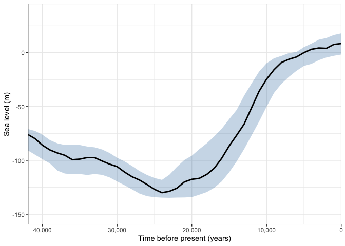<!-- -->

``` r
skyline_r <- read_tsv(
  "02_Mitogenomes_local/restricted_group_70m_data.txt",
  skip = 1,
  col_types = cols()
) %>%
  filter(!is.na(mean), !is.na(time))

skyline_w <- read_tsv(
  "02_Mitogenomes_local/final_widespread_group_data.txt",
  skip = 1,
  col_types = cols()
) %>%
  filter(!is.na(mean), !is.na(time))

x_limits <- c(41927.65, 0)

y_max <- max(skyline_w$upper, na.rm = TRUE)

x_cutoff <- 40000

x_scale <- scale_x_reverse(expand = c(0, 0))
```

``` r
p_widespread <- ggplot(skyline_w, aes(x = time)) +
  geom_ribbon(aes(ymin = lower, ymax = upper),
              fill = "grey80", alpha = 0.7) +
  geom_line(aes(y = mean), linewidth = 1) +
  x_scale +
  coord_cartesian(xlim = c(x_cutoff, 0)) +
  scale_y_continuous(
    labels = scales::label_number(scale = 1e-6, suffix = " m", accuracy = 0.1)
  ) +
  theme_bw() +
  theme(axis.text.x = element_blank(),
        axis.ticks.x = element_blank()) +
  labs(y = expression("Effective population size (" * N[e] * ")"),
       x = NULL) +
  annotate("text",
           x = x_cutoff * 0.97, y = Inf,
           label = "Clade A",
           hjust = 0, vjust = 1.9,
           size = 4, fontface = "bold")


restricted_y_max <- 2.5e6

p_restricted <- ggplot(skyline_r, aes(x = time)) +
  geom_ribbon(aes(ymin = lower, ymax = upper),
              fill = "grey80", alpha = 0.7) +
  geom_line(aes(y = mean), linewidth = 1) +
  x_scale +
  coord_cartesian(xlim = c(x_cutoff, 0)) +
  scale_y_continuous(
    limits = c(0, restricted_y_max),
    labels = scales::label_number(scale = 1e-6, suffix = " m", accuracy = 0.1)
  ) +
  theme_bw() +
  theme(axis.text.x = element_blank(),
        axis.ticks.x = element_blank()) +
  labs(y = expression("Effective population size (" * N[e] * ")"),
       x = NULL) +
  annotate("text",
           x = x_cutoff * 0.97, y = Inf,
           label = "Clade C",
           hjust = 0, vjust = 1.9,
           size = 4, fontface = "bold")


plot_grid(
  p_widespread,
  p_restricted,
  p_sea,
  ncol = 1,
  align = "v",
  axis = "lr",
  rel_heights = c(1, 1, 0.6)
)
```

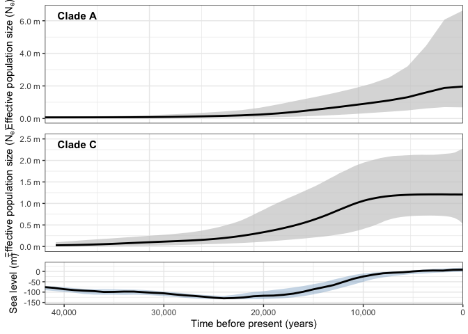<!-- -->
